# Plugins List

[![RusherHack v2.0.6](https://img.shields.io/badge/RusherHack-v2.0.6-purple?logo=data:image/png;base64,iVBORw0KGgoAAAANSUhEUgAAAOsAAADqCAYAAABDVrJwAAAAAXNSR0IArs4c6QAAAARnQU1BAACxjwv8YQUAAAAJcEhZcwAADsQAAA7EAZUrDhsAAAnnSURBVHhe7d0xjx1XGcbxnRUkQUE4Ekj+AqvUqaCMBClooKKAzhJtOiLRuIGIloiI0kTuEBIVoqDhK7ijc0NppUIoQWEt38yxZq3rdx5rX58z98w8c/+/6E1GzsyZOTPz+Pgc390d3n/v6nDR2Te+OUxbfT297t7Vi48+/mTa2r9Hjx5NW/v39798Nm31czn9F8DGEVbABGEFTOTDehjne7GwP+WxxnLTow9l2aW2KjGyAiYIK2CCsAImCCtgIh/WYZwZx6rVYwFAKZccCy/bwz3q0Qf1DmerEiMrYIKwAiYIK2CCsAIm1glrjwUARU32l7yWJdvqQd2PrVvyemNbre1lVb4njKyACcIKmCCsgAnCCphYPqyVk+fVLLnIoNpS1aKlvXhcj2cVz1mqxZLXG9tqbS9L3ZPEdTCyAiYIK2CCsAImCCtgYvGwDuNkOdZM+bVYexUXDl6xeJDW0l7tcS3iOXud100iD4ysgAnCCpggrICJ4YPvv7vnGePqfvWbP0xbR9Qd38Fc7unTp9NWP7/99YfT1kLUcxDP6ztvvzFt9cPICpggrIAJwgqYIKyACcK6pOO/+L8pJbtf1s1fpB/XVmz52pQNXy9hBUwQVsAEYQVMEFbABGFd0lqLE7ULVi3Xq45VVXttmCGsgAnCCpggrIAJwgqYIKxZe1wkiX16nX6pY1WdE7XAtiDCCpggrIAJwgqYIKyACcKadcKFg9XEPu2lX2s58QIbYQVMEFbABGEFTBBWwARhPWcnXhDZFNVXVT1ULuwRVsAEYQVMEFbABGEFTAzfe+ed2fT2cJjPeOXce8jNyA/hx58Ph9PP5GUfLsV5n4nZveiXai/K3qNMW8+J30rVvZN9TZxX7ZMl+7Dw9SrpexeoZ39Qz14YRL8Oz6aNhWR6z8gKmCCsgAnCCpggrIAJucDUIrN4kF6cUJP45IJNZoHldWT6oBYJ6s+Y70P1fup+iLZkx5ILc2lhEbJQizipPijZaxPtqTOo1uR+LfckYGQFTBBWwARhBUwQVsBE0wJT7YJNy+S8ZYFFLmJVfpoqex1qwUIudrTspyTuibxedUqxmJRdOMm+I7XPOvscstehtPRVHqnai8eKfRhZAROEFTBBWAEThBUwkV5gapmgx98S0os66pzJxYPaBYsi01fZg4ZzSgv3f9Ze9joU8Ymjiw5f+piReX5F+jlsBCMrYIKwAiYIK2Bi+O6dO7M/4Ms/yS/45/umeVyD6rldEfZrmRfJY9Vvm+qrTqb/viR5jngtS96P5xr2E0fqawla+pA9Z/ZZK6oHmfOqczKyAiYIK2CCsAImCCtgQn8oQs3Ps195oSbjcT812Re/bbR8f+HsooA8Q6Zf2b4Laq/swoa855WWXjhR9yTbhzX6mm5fHCvvnBr6Kr+/sLo2RlbABGEFTBBWwARhBUws/m1d5KQ97pec2LcsgCjqBwxlv1Kk9lp+/+mn09YtVPPJ9Q/ls08+nrb6+de/P5+2jogFFtlV8U7I92v67wuZ963I7qck39e07PUFjKyACcIKmCCsgAnCCphYPKxlUSBWlNmnKFPuWFnq2PKDjmaVvZZhuLWaxIttbE46cfvy/pZfD9Vy72btDeMziyX2m/V9LL3f+D9iCfK9EaX2G//P/LwJjKyACcIKmCCsgAnCCphoCqtaKFB1cflylSl7rHHmPasy8Y6lyHOqEsqvxlLXEkstHHRRTpMpJe4jO19v4eZke7Pn/Gz8xVBxn1LlSzxjqf2U7LOOt7eUOoeqWUcFRlbABGEFTBBWwARhBUzosMbJbqkyqY4lqMn4bHJf9gs1zrLnJajJuTpnVryO50eObcYq3yPquNR1dFFOk6kM2fl6qjl5n8rziSWUX53VuO9tzznuU0peh5A9NluqPVkhI+MvzkqHFcDmEFbABGEFTBBWwMSlmuzKmf04WY6ljlWT7Exl21LUftn2VKljZ5+UwYy6l0p8tUop5ehZiXPEUuQzFbLtqYtT51DtZWr816wYWQEThBUwQVgBE4QVMFG+aG02V1YT5fFfs1ITY3lsgmprdmFjZdtX7aljValjYynZ/c7d0eN8UVK5f7Gi8XnFUs9BlXr2ityv7BoqfQ5Rs30ERlbABGEFTBBWwARhBUwMH/zgXT2bPaH//PeraauvO99+c9rq5/pafNyp+x3v44uv/j9t9fP2m29MW319eX09bR058XNlZAVMEFbABGEFTBBWwARhLR+KibWksugQa8uy9yO7316t8FwJK2CCsAImCCtgYh9hbZk/rTD32LTs/VD7ZWsrWt6bFTCyAiYIK2CCsAImCCtgYh9h3fIixpYtvcCi2lO1FWbvDSMrYIKwAiYIK2CCsAIm1gnrlhcdOkh3P71jJbMFFkeD+KcWIytggrACJggrYIKwAibWCata2IgLKfXz8NNY8NpU96X0jtiE+I6MdRD/1GJkBUwQVsAEYQVMEFbAxPD+e1fdly3W+KE+xZ//9s9p6wyUBY4tOPFz/flPfjht9ZX+gVjqOVTeE0ZWwARhBUwQVsAEYQVM6LAefQLjRS2pTLBjtTj19QK1FnzXGVkBE4QVMEFYAROEFTChw7rgpLgLt+vdqz08hw33gZEVMEFYAROEFTBBWAEThHUNfOLqtFoWiTb8bAgrYIKwAiYIK2CCsAIm9hvWDS8UNC2AZNWeo/a4Lck++7X6mr2+gJEVMEFYAROEFTBBWAETfmHNTs7XWjzYiux9itRxqtay5HXEtlrby6p8NxlZAROEFTBBWAETq/xgqj/99R/TVl9XV1fTVj/37t2btjYgzskWfvIPHz6ctvp5/PjxtNXXL376o2nrFmoeXHnfGVkBE4QVMEFYAROEFTBBWM/JzV/A39SZOxwOs1pcvOcNpyCsgAnCCpggrIAJwgqY2E5Yj7/y4abg71uiTi35Lg3DMKsu4rUlT8vICpggrIAJwgqYIKyAie2EdcFPemBD/ifq1JZ+lyoXhF6p8voYWQEThBUwQVgBE4QVMEFYgdtULgi9lsQCFmEFTBBWwARhBUwQVsDEZZzXvmJui7dCrWWNB7bGOc9NYgGLkRUwQVgBE4QVMEFYARNtP0VOLTQkWvvdH3M/bUx90+WW75Pz4MGDaaufJ0+eTFv7d/fu3Wmrn/v3709bff3yZz+etvphZAVMEFbABGEFTBBWwERbWG8+bXFcC4rfgLllcanZzSd3bgrIiO9Nw7vDyAqYIKyACcIKmCCsgAnCmnXChbSz07LoUnvcWuJ70/DuEFbABGEFTBBWwARhBUwQVvTXsuhSe9wOEFbABGEFTBBWwARhBUz0Cavbp06ADWJkBUwQVsAEYQVM9AnrGf9FNlYQ10h2sk7CyAqYIKyACcIKmCCsgIWLi68BQPqYEKtSNCEAAAAASUVORK5CYII=)](https://rusherhack.org/changelog.html)

> [!WARNING]
> None of the plugins listed here have been verified or confirmed to be safe. Use at your own risk!

> [!IMPORTANT]
> These plugins are not affiliated with or endorsed by Rusher Development LLC.

Community-created plugins to extend RusherHack’s functionality.

## Plugins

Regular plugins extend RusherHack’s functionality without modifying Minecraft's internal behavior. Key features:

- Can be reloaded in-game using `*reload` in chat or `reload` in the RusherHack console (`~` key).
- Can be added or removed from the `.minecraft/rusherhack/plugins/` folder while the game is running.

## Core Plugins

Core plugins provide deeper integration with RusherHack by modifying Minecraft’s internals using mixins. Key differences:

- **Cannot be reloaded** using `*reload`.
- Must be placed in the `.minecraft/rusherhack/plugins/` folder before launching the game.

## Badge Info

> [!TIP]
> Badges provide quick access to plugin resources:
>
> - **Latest Release** – links to the plugin’s GitHub releases page.
> - **Downloads** – directly downloads the latest plugin `.jar` file.
> - **MC Version** – displays the supported Minecraft version range.

## Top 5 Downloaded Plugins

View Top 5 Plugins

| Name | Creator | Description | Downloads |
|------|---------|-------------|-----------|
| [RusherHack Spotify Integration](https://github.com/John200410/rusherhack-spotify) |  John200410 | Integrates Spotify music playback controls and status into the RusherHacks client. |  |
| [Container Tweaks](https://github.com/rfresh2/ContainerTweaks-rusherhack) |  rfresh2 | Simple tweaks for quickly moving items in containers. |  |
| [Shay's RusherTweaks](https://github.com/ShayBox/ShaysRusherTweaks) |  ShayBox | A collection of small tweaks and improvements for the RusherHacks client. |  |
| [Nuker](https://github.com/beanbag44/Nuker) |  beanbag44 | Epic nuker for nuking terrain. |  |
| [RusherHack Instance Info](https://github.com/John200410/rusherhack-instance-info) |  John200410 | Provides detailed information about the current instance. |  |

## Plugin List

> [!NOTE]
> The following plugins are community contributions. Always verify the source code and test plugins in a safe environment before using them in your main game.

> [!TIP]
> Use the **Outline** on the right side of this page to quickly navigate to a specific plugin. Alternatively, press **Ctrl + F** to search for a plugin name directly.

---

- ### [Example Plugin](https://github.com/RusherDevelopment/example-plugin)  

     

   **Creator**:  [RusherDevelopment](https://github.com/RusherDevelopment)

   A basic example plugin demonstrating the structure and capabilities of RusherHacks plugins.

---

- ### [2b2t.vc Rusherhack](https://github.com/rfresh2/2b2t.vc-rusherhack)  

     
    

   **Creator**:  [rfresh2](https://github.com/rfresh2)

   A RusherHacks plugin designed for 2b2t.vc server use.

   

     
Show Screenshots

     

       
       
     

   

---

- ### [RusherHack-HudElement](https://github.com/Aspect-404/RusherHack-HudElement)  

     
    
   
   **Creator**:  [Aspect-404](https://github.com/Aspect-404)

   Create a customizable HUD element for Minecraft utility mod RusherHack.

   

     
Show Screenshots

     

       
       
     

   

---

- ### [Auto Anvil Rename](https://github.com/IceTank/AutoAnvilRename)  

     
    
   
   **Creator**:  [IceTank](https://github.com/IceTank)

   Automates the renaming process in anvils.

   

     
Show Screenshots

     

       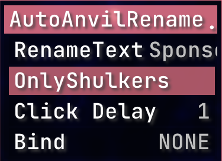
       
     

   

---

- ### [Queue Manager](https://github.com/GabiRP/QueueManager)  

     
    

   **Creator**:  [GabiRP](https://github.com/GabiRP)

   Manages queue positions and notifies users of their status.

---

- ### [RusherHack Instance Info](https://github.com/John200410/rusherhack-instance-info)  

     
    

   **Creator**:  [John200410](https://github.com/John200410)

   Provides detailed information about the current instance.

   

     
Show Screenshots

     

       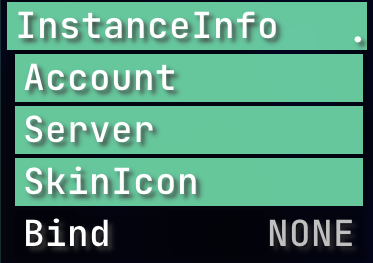
       
       
     

   

---

- ### [Stash Mover Plugin](https://github.com/xyzbtw/StashMoverPlugin)  

     
    
   
   **Creator**:  [xyzbtw](https://github.com/xyzbtw)

   A plugin to move stashes using pearls.

   

     
Show Screenshots/Videos

     

       
     

   

---

- ### [Unified Module List](https://github.com/czho/unified-modulelist)  

     
    
   
   **Creator**:  [czho](https://github.com/czho)

   Rusherhack HUD element that shows active modules from both meteorclient and rusherhack.

---

- ### [Container Tweaks](https://github.com/rfresh2/ContainerTweaks-rusherhack)  

     
    
   
   **Creator**:  [rfresh2](https://github.com/rfresh2)

   Simple tweaks for quickly moving items in containers.

   

     
Show Screenshots

     

       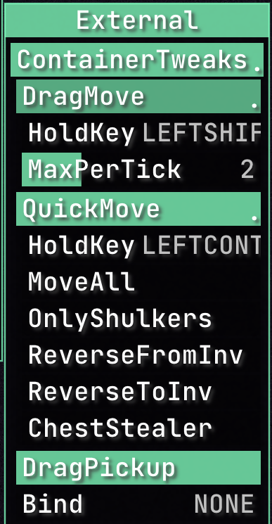
     

   

---

- ### [RusherHack Spotify Integration](https://github.com/John200410/rusherhack-spotify)    

     
    

   **Creator**:  [John200410](https://github.com/John200410)  

   Integrates Spotify music playback controls and status into the RusherHacks client.  

   
  
     
Show Screenshots
  
     
  
       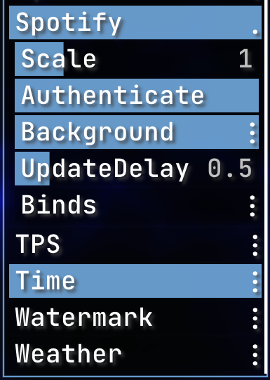  
       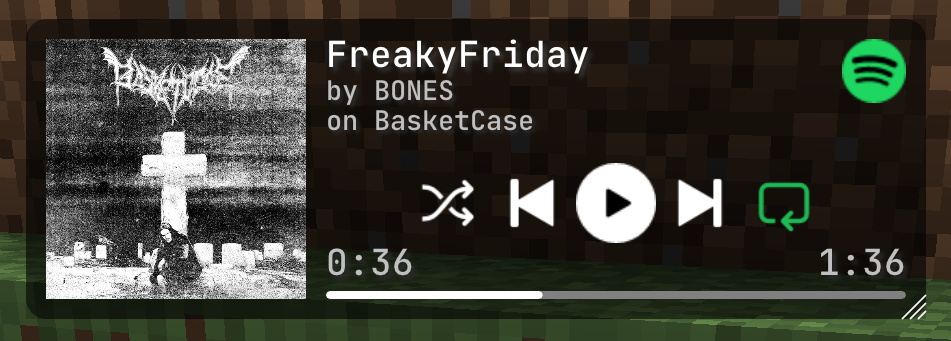  
     
  
   

---

- ### [Vanilla Elytra Flight](https://github.com/FBanna/Rusherhack-Vanilla-Efly)    

      
    
   
   **Creator**:  [FBanna](https://github.com/FBanna)  

   Highly customizable rusher hack elytra flight plugin.

---

- ### [Rusherhack BookBot](https://github.com/Aspect-404/Rusherhack-BookBot)  

     
    
   
   **Creator**:  [Aspect-404](https://github.com/Aspect-404)

   Rusherhack plugin for bookbot.

---

- ### [Shay's RusherTweaks](https://github.com/ShayBox/ShaysRusherTweaks)  

     
    
   
   **Creator**:  [ShayBox](https://github.com/ShayBox)

   A collection of small tweaks and improvements for the RusherHacks client.

---

- ### [Nuker](https://github.com/beanbag44/Nuker)  

     
    

   **Creator**:  [beanbag44](https://github.com/beanbag44)

   Epic nuker for nuking terrain.

   

     
Show Screenshots/Videos

     

       
     

   

---

- ### [Hold Rusher](https://github.com/cherosin/hold-rusher)    

     
    
   
   **Creator**:  [cherosin](https://github.com/cherosin)  

   Adds a "Hold" flag for all modules, if active keybind will only be toggled while held.

---

- ### [No Walk Animation](https://github.com/Eonexe/NoWalkAnimation)  

     
    

   **Creator**:  [Eonexe](https://github.com/Eonexe)

   Removes the walking animation.

---

- ### [NBT Utils](https://github.com/kybe236/rusherhack-nbt-utils)  

     
    

   **Creator**:  [kybe236](https://github.com/kybe236)

   Rusher nbt paste and copy.

---

- ### [Rusherhack Executer](https://github.com/kybe236/rusherhack-executer)  

     
    
   
   **Creator**:  [kybe236](https://github.com/kybe236)

   Executes commands and resolves `<player>` to every player online.

---

- ### [F3 Spoof](https://github.com/Doogie13/f3-spoof)  

     
    
   
   **Creator**:  [Doogie13](https://github.com/Doogie13)

   Spoofs the F3 debug screen information.

---

- ### [Open Folder](https://github.com/kybe236/rusherhack-open-folder)  

     
    
   
   **Creator**:  [kybe236](https://github.com/kybe236)

   Opens the folder for the module with a button click.

   

     
Show Screenshots/Videos

     

       
     

   

---

- ### [Mace Kill](https://github.com/kybe236/rusherhack-mace-kill)    

     
    
   
   **Creator**:  [kybe236](https://github.com/kybe236)  

   One shot pretty much all mobs with a mace.  

   
  
     
Show Screenshots/Videos
  
     
  
         
     
  
   

---

- ### [Weather Changing Plugin](https://github.com/Lokfid/WeatherChangingPlugin)  

     
    
   
   **Creator**:  [Lokfid](https://github.com/Lokfid)

   Allows players to change the weather in-game.

---

- ### [Middleclick Wind Charge](https://github.com/kybe236/rusherhack-middleclick-wind-charge)  

     
    
   
   **Creator**:  [kybe236](https://github.com/kybe236)

   Allows you to throw windcharges with the middle mouse button and also jump at the same time so you can boost jump.

   

     
Show Screenshots/Videos

     

       
     

   

---

- ### [GarlicSight](https://github.com/GarlicRot/GarlicSight)  

     
    
   
   **Creator**:  [GarlicRot](https://github.com/GarlicRot)

   A RusherHacks Plugin - Crosshair Info - GarlicSight.

   

     
Show Screenshots

     

       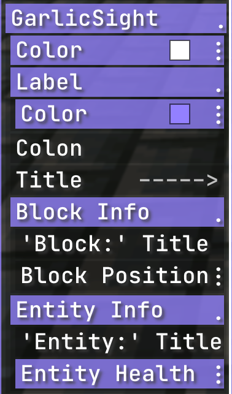
       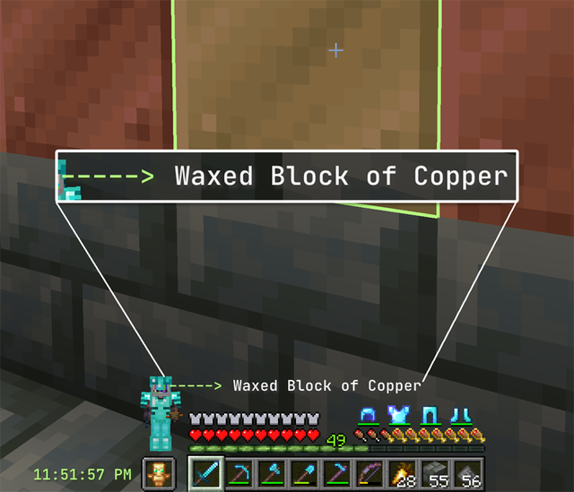
       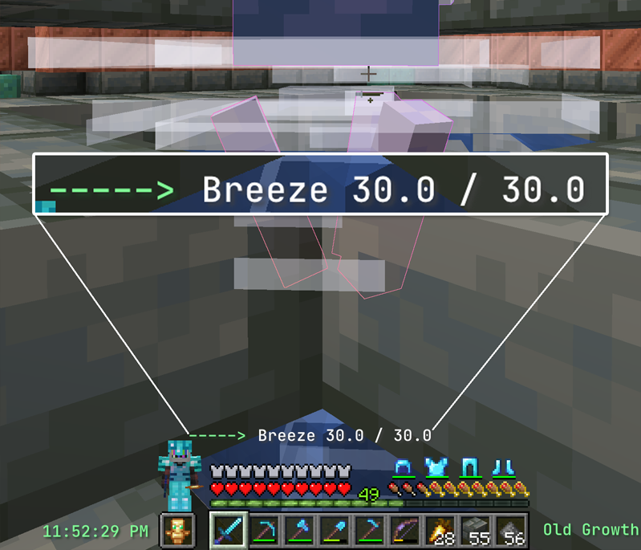
     

   

---

- ### [LightningPop](https://github.com/GarlicRot/LightningPop)  

     
    
   
   **Creator**:  [GarlicRot](https://github.com/GarlicRot)

   A RusherHacks Plugin - Spawns Lightning On Totem Pops And Player Deaths - LightningPop.

   

     
Show Screenshots

     

       
     

   

---

- ### [AutoBucket](https://github.com/GarlicRot/AutoBucket)  

     
    
   
   **Creator**:  [GarlicRot](https://github.com/GarlicRot)

   A RusherHacks Plugin - Auto Bucket Entities - AutoBucket.

   

     
Show Screenshots

     

       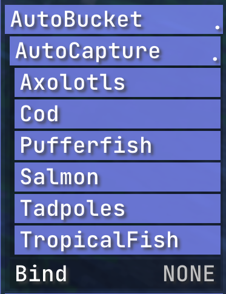
     

   

---

- ### [RusherHack-BoatExecute](https://github.com/PhilipPanda/RusherHack-BoatExecute)  

     
    
   
   **Creator**:  [PhilipPanda](https://github.com/PhilipPanda)

   A RusherHack module plugin for 1.20.4 that exploits boat movement packets to instantly kill all passengers.

   

     
Show Screenshots/Videos

     

       
     

   

---

- ### [NBT Viewer](https://github.com/Gentleman2292/NBT-viewer)  

     
    
   
   **Creator**:  [Gentleman2292](https://github.com/Gentleman2292)

   A plugin to view NBT data in Minecraft.

   

     
Show Screenshots

     

       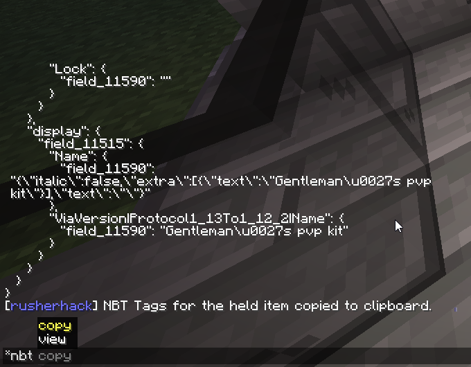
     

   

---

- ### [Remote Control](https://github.com/kybe236/rusherhack-remote-controle)  

     
    
   **Creator**:  [kybe236](https://github.com/kybe236)

   A plugin for remote controlling RusherHacks.

---

- ### [Speed Measure](https://github.com/Lokfid/RusherHackSpeedMeasure)  

     
    

   **Creator**:  [Lokfid](https://github.com/Lokfid)

   A plugin to measure speed in RusherHacks.

   **Original Creator**:  [IceTank](https://github.com/IceTank)

---

- ### [TNT Bomber](https://github.com/kybe236/rusher-tnt-bomber)  

     
    
   
   **Creator**:  [kybe236](https://github.com/kybe236)

   A plugin to automate TNT bombing in Minecraft.

---

- ### [No Render Entities](https://github.com/John200410/norender-entities)  

     
    
   
   **Creator**:  [John200410](https://github.com/John200410)

   A plugin to disable rendering of entities.

---

- ### [RusherHack Messenger](https://github.com/Gentleman2292/rusherhack-messenger)  

     
    

   **Creator**:  [Gentleman2292](https://github.com/Gentleman2292)

   A messaging plugin for RusherHacks.

   

     
Show Screenshots/Videos

     

       <a href="https://rusherhack.org/i/14z9f6ewlu.mp4">
         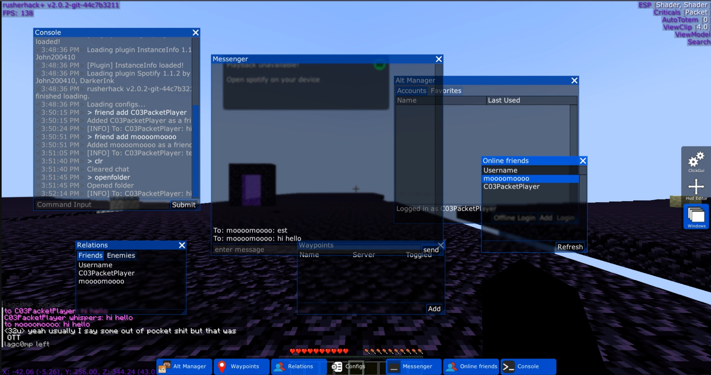
       </a>
     

   

---

- ### [RusherHack Instance Info (Fork)](https://github.com/GarlicRot/rusherhack-instance-info)  

     
    
   
   **Creator**:  [GarlicRot](https://github.com/GarlicRot)

   A forked version of the [original plugin](https://github.com/John200410/rusherhack-instance-info) with custom settings.

   

     
Show Screenshots

     

       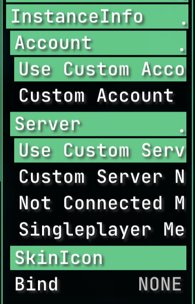
       
       
     

   

---

- ### [RusherHack NoteBot](https://github.com/Lokfid/RusherHackNoteBot)    

     
    
   
   **Creator**:  [Lokfid](https://github.com/Lokfid)  

   A RusherHacks plugin for playing note blocks in Minecraft.

---

- ### [ShulkerViewer](https://github.com/xyzbtw/ShulkerViewer)  

     
    
   
   **Creator**:  [xyzbtw](https://github.com/xyzbtw)

   A RusherHacks plugin to view the contents of Shulker boxes in the inventory.

---

- ### [RusherWebPlugin](https://github.com/Lokfid/RusherWebPlugin)    

     
    
   
   **Creator**:  [Lokfid](https://github.com/Lokfid)  

   Web Browser for rh.

---

- ### [UpdatedNCPEfly](https://github.com/xyzbtw/UpdatedNCPEfly)  

     
    
   
   **Creator**:  [xyzbtw](https://github.com/xyzbtw)

   A plugin for an updated version of NCPEfly.

---

- ### [dc-chat-logger](https://github.com/kybe236/dc-chat-logger)  

     
    
   
   **Creator**:  [kybe236](https://github.com/kybe236)

   A plugin for logging chat messages to discord.

---

- ### [rusherhack-nightvision-plugin](https://github.com/John200410/rusherhack-nightvision-plugin)  

     
    
   
   **Creator**:  [John200410](https://github.com/John200410)

   A replacement for FullBright when using shaders.

---

- ### [AutoNetherite](https://github.com/xyzbtw/AutoNetherite)  

     
    
   
   **Creator**:  [xyzbtw](https://github.com/xyzbtw)

   A plugin that automates the process of upgrading gear to Netherite in Minecraft.

---

- ### [OldSignsPlugin](https://github.com/xyzbtw/OldSignsPlugin)  

     
    
   
   **Creator**:  [xyzbtw](https://github.com/xyzbtw)

   A plugin that brings back old sign functionalities in Minecraft.

---

- ### [StashHunter-rusherhack](https://github.com/CherkaSSH/StashHunter-rusherhack)  

     
    
   
   **Creator**:  [CherkaSSH](https://github.com/CherkaSSH)

   A plugin to help locate stashes in Minecraft using RusherHack.

---

- ### [rusher-elytra-eta](https://github.com/kybe236/rusher-elytra-eta)  
     
    
   
   **Creator**:  [kybe236](https://github.com/kybe236)

   A rusherhack plugin that allows you to see the ETA of all Elytras in the player's inventory.

   

    
Show Screenshots

     

      
    

   

---

- ### [rusher-silent-close](https://github.com/kybe236/rusher-silent-close)  

     
    
   
   **Creator**:  [kybe236](https://github.com/kybe236)

   Keeps Container GUI open

---

- ### [rusherhack-addons](https://github.com/miles352/rusherhack-addons)  

     
    
   
   **Creator**:  [miles352](https://github.com/miles352)

   A collection of RusherHacks addons including:
   - **AFKBoostFly**: Enables boost flying while AFK by looking up and down to gain momentum.
   - **MapCopy**: Allows you to copy maps in your inventory.

---

- ### [rusher-gtranslate](https://github.com/kybe236/rusher-gtranslate)    

     
    
   
   **Creator**:  [kybe236](https://github.com/kybe236)  

   A plugin that integrates Google Translate into RusherHack for translating chat messages.

---

- ### [rusher-matrix-nofall](https://github.com/kybe236/rusher-matrix-nofall)  
     
    
   
   **Creator**:  [kybe236](https://github.com/kybe236)
  
   No Fall by setting isFalling flag in movement packets to false (tested on 6b6t).

---

- ### [rusher-autoportal](https://github.com/kybe236/rusher-autoportal)    

     
    
   
   **Creator**:  [kybe236](https://github.com/kybe236)  

   Automatically breaks blocks to place obsidian and activate the nether portal.

---

- ### [rusher-air-place](https://github.com/kybe236/rusher-air-place)  

     
    
   
   **Creator**:  [kybe236](https://github.com/kybe236)

   A plugin that allows placing blocks in the air in Minecraft.

---

- ### [rusher-hold-spamm-space](https://github.com/kybe236/rusher-hold-spamm-space)  

     
    
   
   **Creator**:  [kybe236](https://github.com/kybe236)

   A plugin that automatically spams or holds the space bar.

---

- ### [rusher-auto-bed-bomber](https://github.com/kybe236/rusher-auto-bed-bomber)  

     
    
   
   **Creator**:  [kybe236](https://github.com/kybe236)

   A plugin that automates bed bombing in Minecraft.

---

- ### [rusher-crystal-spin](https://github.com/kybe236/rusher-crystal-spin)  

     
    

   **Creator**:  [kybe236](https://github.com/kybe236)

   A plugin that makes end crystals spin faster or slower.

---

- ### [AutoShear](https://github.com/oisin404/AutoShear)  

     
    
   
   **Creator**:  [oisin404](https://github.com/oisin404)

   A plugin that automates shearing in Minecraft.

   

     
Show Video

     

       
     

   

---

- ### [Rusher2b2tVelocity](https://github.com/Lokfid/Rusher2b2tVelocity)  

     
    
   
   **Creator**:  [Lokfid](https://github.com/Lokfid)

   A plugin that adds enhanced velocity control for RusherHacks on the 2b2t server.

---

- ### [rusher-autokit](https://github.com/kybe236/rusher-autokit)  

     
    
   
   **Creator**:  [kybe236](https://github.com/kybe236)

   A plugin that automatically equips your preferred kit.

---

- ### [AutoTorch](https://github.com/NinetyUnderScore/AutoTorch)  

     
    
   
   **Creator**:  [NinetyUnderScore](https://github.com/NinetyUnderScore)

   Automatically places torches to light up areas in Minecraft.

---

- ### [Elytra Swap](https://github.com/cmg-divined/elytra-swap)  
     
    
   
   **Creator**:  [cmg-divined](https://github.com/cmg-divined)

   Automatically swaps fully repaired Elytras with damaged ones for efficient XP farm repairs.

---

- ### [HDisabler](https://github.com/CherkaSSH/hdisabler)  
     
    
   
   **Creator**:  [CherkaSSH](https://github.com/CherkaSSH)
  
   2b2t fast bypass.
  
   

   
Show Screenshots

  

    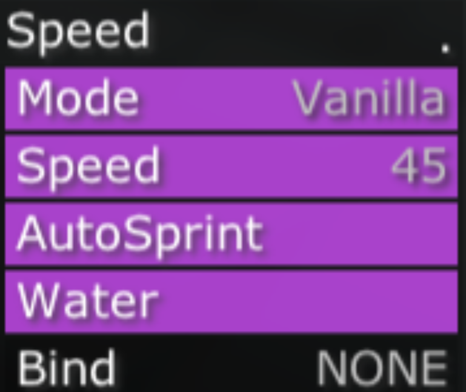
  

   

---

- ### [CoordFollower](https://github.com/CherkaSSH/CoordFollower-plugin)  
     
    
   
   **Creator**:  [CherkaSSH](https://github.com/CherkaSSH)

   A plugin that allows you to save, manage, and follow coordinates with ease.

   

  
Show Usage Instructions

  <ul>
    <li><strong>add</strong>: Adds coordinates to the list.  
          - Use <code>add</code> to add your current coordinates.  
    </li>
    <li><strong>del</strong>: Deletes coordinates from the list.  
          - Use <code>del &lt;n&gt;</code> to delete the coordinate at position <code>n</code>.  
          - Use <code>del</code> without parameters to delete the last coordinate in the list.  
    </li>
    <li><strong>list</strong>: Displays all saved coordinates.</li>
    <li><strong>save/load</strong>: Saves or loads the coordinate list to/from an encrypted file.  
          - Files are saved as <code>name.coords</code>.  
          - Files are encrypted using a password (<code>pass</code>).
    </li>
  </ul>

---

- ### [Rusher Chess TUI](https://github.com/CherkaSSH/rusher-chess-tui)  
     
    
   
   **Creator**:  [CherkaSSH](https://github.com/CherkaSSH)

     Chess module for RusherHacks, powered by [ChessLib](https://github.com/bhlangonijr/chesslib).

---

- ### [ActivatedSpawnerDetector](https://github.com/un0x9/ActivatedSpawnerDetector)  

     
    
   
   **Creator**:  [un0x9](https://github.com/un0x9)

   Detects activated spawners and provides visual feedback in RusherHacks.

---

- ### [Rusher Discord Notifications](https://github.com/kybe236/rusher-discord-notifications)  

     
    
   
   **Creator**:  [kybe236](https://github.com/kybe236)

   Sends notifications from RusherHacks to a Discord channel.

---

- ### [AutoBonemeal](https://github.com/John200410/rusherhack-autobonemeal)  

     
    
   
   **Creator**:  [John200410](https://github.com/John200410)

   A RusherHacks plugin for automatically applying bonemeal to crops.

---

- ### [Rocket3](https://github.com/PK268/Rocket3)  

     
    
   
   **Creator**:  [PK268](https://github.com/PK268)

   A RusherHacks plugin for crafting duration 3 rockets.

---

- ### [GarlicBreeder](https://github.com/GarlicRot/GarlicBreeder)  

     
    
   
   **Creator**:  [GarlicRot](https://github.com/GarlicRot)

   A RusherHacks plugin that automates the breeding of mobs in Minecraft.

---

- ### [Rusher Item Saver](https://github.com/kybe236/rusher-item-saver)  

    
    
    
   
   **Creator**:  [kybe236](https://github.com/kybe236)

   A RusherHacks plugin that saves items from being lost.

---

- ### [RusherHack Mace Swap](https://github.com/kybe236/rusherhack-mace-swap)  

    
    
    
   
   **Creator**:  [kybe236](https://github.com/kybe236)

   A RusherHacks plugin that automatically swaps to a mace when attacking.

---

- ### [Example Core Plugin](https://github.com/RusherDevelopment/example-core-plugin)

       

   **Creator**:  [RusherDevelopment](https://github.com/RusherDevelopment)  

   A core plugin example demonstrating mixin support in RusherHack.

---

- ### [CrystalModifierRH](https://github.com/xyzbtw/CrystalModifierRH)

      
    
   
   **Creator**:  [xyzbtw](https://github.com/xyzbtw)  

   A plugin for modifying the rendering of end crystals in Minecraft using mixins in RusherHack.

---

- ### [Tablist Hats](https://github.com/rfresh2/TablistHats-rusherhack)

      
    
   
   **Creator**:  [rfresh2](https://github.com/rfresh2)  

   Enables hat layer rendering for player heads on the tablist, even if the player isn't in render distance.

   

     
Show Screenshot

     

       
     

   

---

- ### [NoSound](https://github.com/John200410/nosound)

      
    
   
   **Creator**:  [John200410](https://github.com/John200410)  

   A core plugin that disables specific in-game sounds in RusherHack.

---

- ### [RusherHack Coord Spoofer](https://github.com/kybe236/rusherhack-coord-spoofer)

      
    
   
   **Creator**:  [kybe236](https://github.com/kybe236)  

   A core plugin for spoofing player coordinates in RusherHack.

---

- ### [Rusher Auto Item Frame Dupe](https://github.com/kybe236/rusher-auto-item-frame-dupe)  

     
    
   
   **Creator**:  [kybe236](https://github.com/kybe236)  

   A plugin for automating item frame duplication in RusherHack.

---

- ### [RusherMoji](https://github.com/Lokfid/RusherMoji)  

      
    
   
   **Creator**:  [Lokfid](https://github.com/Lokfid)  

   A core plugin for adding custom emoji functionality in RusherHack.

---

- ### [RusherHack Piston Pusher](https://github.com/kybe236/rusherhack-piston-pusher)  

     
    
   
   **Creator**:  [kybe236](https://github.com/kybe236)  

   A plugin that automates pushing end crystals with pistons to attack players in RusherHack.

---

- ### [RusherUtils](https://github.com/0tterware/RusherUtils)  

     
    
   
   **Creator**:  [0tterware](https://github.com/0tterware)  

   RusherUtils automates Wither and TNT tasks with HUD counters for RusherHack.  

   
  
     
Show Screenshots/Videos
  
     
  
         
     
  
   

---

- ### [Rusher Grown ESP](https://github.com/kybe236/rusher-grown-esp)  

     
    

   **Creator**:  [kybe236](https://github.com/kybe236)  

   ESP plugin for RusherHack that highlights grown crops and useful farm blocks.

---

