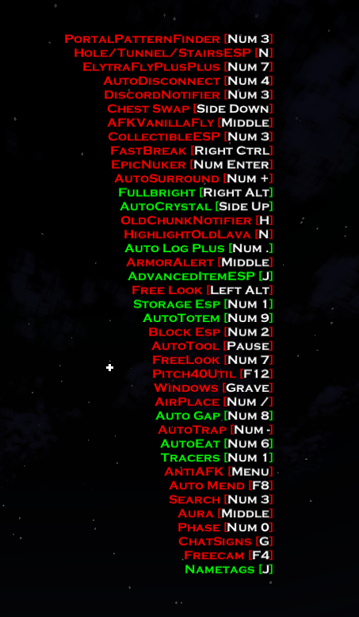

<!--
  RusherHacks Plugin Collection - PLUGINS.md
  NOTICE: This file is auto-generated from data/plugins-and-themes.yml.
  Please do not edit this file directly.
  To contribute plugins or themes, refer to the Contributing Guide (CONTRIBUTING.md) for straightforward submission instructions.
  All changes must be submitted via a pull request to maintain consistency.
-->

# Plugins List

[![RusherHack v2.0.6](https://img.shields.io/badge/RusherHack-v2.0.6-purple?logo=data:image/png;base64,iVBORw0KGgoAAAANSUhEUgAAAOsAAADqCAYAAABDVrJwAAAAAXNSR0IArs4c6QAAAARnQU1BAACxjwv8YQUAAAAJcEhZcwAADsQAAA7EAZUrDhsAAAnnSURBVHhe7d0xjx1XGcbxnRUkQUE4Ekj+AqvUqaCMBClooKKAzhJtOiLRuIGIloiI0kTuEBIVoqDhK7ijc0NppUIoQWEt38yxZq3rdx5rX58z98w8c/+/6E1GzsyZOTPz+Pgc390d3n/v6nDR2Te+OUxbfT297t7Vi48+/mTa2r9Hjx5NW/v39798Nm31czn9F8DGEVbABGEFTOTDehjne7GwP+WxxnLTow9l2aW2KjGyAiYIK2CCsAImCCtgIh/WYZwZx6rVYwFAKZccCy/bwz3q0Qf1DmerEiMrYIKwAiYIK2CCsAIm1glrjwUARU32l7yWJdvqQd2PrVvyemNbre1lVb4njKyACcIKmCCsgAnCCphYPqyVk+fVLLnIoNpS1aKlvXhcj2cVz1mqxZLXG9tqbS9L3ZPEdTCyAiYIK2CCsAImCCtgYvGwDuNkOdZM+bVYexUXDl6xeJDW0l7tcS3iOXud100iD4ysgAnCCpggrICJ4YPvv7vnGePqfvWbP0xbR9Qd38Fc7unTp9NWP7/99YfT1kLUcxDP6ztvvzFt9cPICpggrIAJwgqYIKyACcK6pOO/+L8pJbtf1s1fpB/XVmz52pQNXy9hBUwQVsAEYQVMEFbABGFd0lqLE7ULVi3Xq45VVXttmCGsgAnCCpggrIAJwgqYIKxZe1wkiX16nX6pY1WdE7XAtiDCCpggrIAJwgqYIKyACcKadcKFg9XEPu2lX2s58QIbYQVMEFbABGEFTBBWwARhPWcnXhDZFNVXVT1ULuwRVsAEYQVMEFbABGEFTAzfe+ed2fT2cJjPeOXce8jNyA/hx58Ph9PP5GUfLsV5n4nZveiXai/K3qNMW8+J30rVvZN9TZxX7ZMl+7Dw9SrpexeoZ39Qz14YRL8Oz6aNhWR6z8gKmCCsgAnCCpggrIAJucDUIrN4kF6cUJP45IJNZoHldWT6oBYJ6s+Y70P1fup+iLZkx5ILc2lhEbJQizipPijZaxPtqTOo1uR+LfckYGQFTBBWwARhBUwQVsBE0wJT7YJNy+S8ZYFFLmJVfpoqex1qwUIudrTspyTuibxedUqxmJRdOMm+I7XPOvscstehtPRVHqnai8eKfRhZAROEFTBBWAEThBUwkV5gapmgx98S0os66pzJxYPaBYsi01fZg4ZzSgv3f9Ze9joU8Ymjiw5f+piReX5F+jlsBCMrYIKwAiYIK2Bi+O6dO7M/4Ms/yS/45/umeVyD6rldEfZrmRfJY9Vvm+qrTqb/viR5jngtS96P5xr2E0fqawla+pA9Z/ZZK6oHmfOqczKyAiYIK2CCsAImCCtgQn8oQs3Ps195oSbjcT812Re/bbR8f+HsooA8Q6Zf2b4Laq/swoa855WWXjhR9yTbhzX6mm5fHCvvnBr6Kr+/sLo2RlbABGEFTBBWwARhBUws/m1d5KQ97pec2LcsgCjqBwxlv1Kk9lp+/+mn09YtVPPJ9Q/ls08+nrb6+de/P5+2jogFFtlV8U7I92v67wuZ963I7qck39e07PUFjKyACcIKmCCsgAnCCphYPKxlUSBWlNmnKFPuWFnq2PKDjmaVvZZhuLWaxIttbE46cfvy/pZfD9Vy72btDeMziyX2m/V9LL3f+D9iCfK9EaX2G//P/LwJjKyACcIKmCCsgAnCCphoCqtaKFB1cflylSl7rHHmPasy8Y6lyHOqEsqvxlLXEkstHHRRTpMpJe4jO19v4eZke7Pn/Gz8xVBxn1LlSzxjqf2U7LOOt7eUOoeqWUcFRlbABGEFTBBWwARhBUzosMbJbqkyqY4lqMn4bHJf9gs1zrLnJajJuTpnVryO50eObcYq3yPquNR1dFFOk6kM2fl6qjl5n8rziSWUX53VuO9tzznuU0peh5A9NluqPVkhI+MvzkqHFcDmEFbABGEFTBBWwMSlmuzKmf04WY6ljlWT7Exl21LUftn2VKljZ5+UwYy6l0p8tUop5ehZiXPEUuQzFbLtqYtT51DtZWr816wYWQEThBUwQVgBE4QVMFG+aG02V1YT5fFfs1ITY3lsgmprdmFjZdtX7aljValjYynZ/c7d0eN8UVK5f7Gi8XnFUs9BlXr2ityv7BoqfQ5Rs30ERlbABGEFTBBWwARhBUwMH/zgXT2bPaH//PeraauvO99+c9rq5/pafNyp+x3v44uv/j9t9fP2m29MW319eX09bR058XNlZAVMEFbABGEFTBBWwARhLR+KibWksugQa8uy9yO7316t8FwJK2CCsAImCCtgYh9hbZk/rTD32LTs/VD7ZWsrWt6bFTCyAiYIK2CCsAImCCtgYh9h3fIixpYtvcCi2lO1FWbvDSMrYIKwAiYIK2CCsAIm1gnrlhcdOkh3P71jJbMFFkeD+KcWIytggrACJggrYIKwAibWCata2IgLKfXz8NNY8NpU96X0jtiE+I6MdRD/1GJkBUwQVsAEYQVMEFbAxPD+e1fdly3W+KE+xZ//9s9p6wyUBY4tOPFz/flPfjht9ZX+gVjqOVTeE0ZWwARhBUwQVsAEYQVM6LAefQLjRS2pTLBjtTj19QK1FnzXGVkBE4QVMEFYAROEFTChw7rgpLgLt+vdqz08hw33gZEVMEFYAROEFTBBWAEThHUNfOLqtFoWiTb8bAgrYIKwAiYIK2CCsAIm9hvWDS8UNC2AZNWeo/a4Lck++7X6mr2+gJEVMEFYAROEFTBBWAETfmHNTs7XWjzYiux9itRxqtay5HXEtlrby6p8NxlZAROEFTBBWAETq/xgqj/99R/TVl9XV1fTVj/37t2btjYgzskWfvIPHz6ctvp5/PjxtNXXL376o2nrFmoeXHnfGVkBE4QVMEFYAROEFTBBWM/JzV/A39SZOxwOs1pcvOcNpyCsgAnCCpggrIAJwgqY2E5Yj7/y4abg71uiTi35Lg3DMKsu4rUlT8vICpggrIAJwgqYIKyAie2EdcFPemBD/ifq1JZ+lyoXhF6p8voYWQEThBUwQVgBE4QVMEFYgdtULgi9lsQCFmEFTBBWwARhBUwQVsDEZZzXvmJui7dCrWWNB7bGOc9NYgGLkRUwQVgBE4QVMEFYARNtP0VOLTQkWvvdH3M/bUx90+WW75Pz4MGDaaufJ0+eTFv7d/fu3Wmrn/v3709bff3yZz+etvphZAVMEFbABGEFTBBWwERbWG8+bXFcC4rfgLllcanZzSd3bgrIiO9Nw7vDyAqYIKyACcIKmCCsgAnCmnXChbSz07LoUnvcWuJ70/DuEFbABGEFTBBWwARhBUwQVvTXsuhSe9wOEFbABGEFTBBWwARhBUz0Cavbp06ADWJkBUwQVsAEYQVM9AnrGf9FNlYQ10h2sk7CyAqYIKyACcIKmCCsgIWLi68BQPqYEKtSNCEAAAAASUVORK5CYII=)](https://rusherhack.org/changelog.html)

> [!WARNING]
> None of the plugins listed here have been verified or confirmed to be safe. Use at your own risk!

> [!IMPORTANT]
> These plugins are not affiliated with or endorsed by Rusher Development LLC.

Community-created plugins to extend RusherHack’s functionality.

## Plugins

Regular plugins extend RusherHack’s functionality without modifying Minecraft's internal behavior. Key features:

- Can be reloaded in-game using `*reload` in chat or `reload` in the RusherHack console (`~` key).
- Can be added or removed from the `.minecraft/rusherhack/plugins/` folder while the game is running.

## Core Plugins

Core plugins provide deeper integration with RusherHack by modifying Minecraft’s internals using mixins. Key differences:

- **Cannot be reloaded** using `*reload`.
- Must be placed in the `.minecraft/rusherhack/plugins/` folder before launching the game.

## Recently Added Plugins

<!--- Recently Added Plugins Start -->
> These are the six most recently added plugins (based on `added_at`).

<table>
<tr>
<td align="left" valign="top" width="50%">
  
  
<strong><a href="https://github.com/tr330ne/waypointsync">WaypointSync</a></strong>&nbsp;<code>plugin</code>

  
Automatically synchronizes waypoints from Xaero to Rusher.

  

    
    &nbsp;
    &nbsp;
  

</td>
<td align="left" valign="top" width="50%">
  
  
<strong><a href="https://github.com/musheck/mushack">HighwayBuilder</a></strong>&nbsp;<code>plugin</code>

  
Automated highway builder with full placement, breaking, and rendering controls. Supports adjustable width/height, rails, rotation/airplace modes, placement delay, max breaks per tick, and visual block previews. Runs continuously until disabled.

  

    
    &nbsp;
    &nbsp;
  

</td></tr>
<tr>
<td align="left" valign="top" width="50%">
  
  
<strong><a href="https://github.com/tillay-rh-plugins/polar-spiral-efly">Polar Spiral EFly</a></strong>&nbsp;<code>plugin</code>

  
Overworld AFK Elytra flight that flies in a smooth polar spiral pattern for basehunting.

  

    
    &nbsp;
    &nbsp;
  

</td>
<td align="left" valign="top" width="50%">
  
  
<strong><a href="https://github.com/tillay-rh-plugins/example-chatbot">Example Chatbot</a></strong>&nbsp;<code>plugin</code>

  
Example chat automation module that listens to public chat and whispers.

  

    
    &nbsp;
    &nbsp;
  

</td></tr>
<tr>
<td align="left" valign="top" width="50%">
  
  
<strong><a href="https://github.com/Koteyka32k/rh-startupsound">StartupSound</a></strong>&nbsp;<code>plugin</code>

  
Plays a custom `.ogg` sound on RusherHack startup. Supports selecting a specific file or choosing a random sound from `rusherhack/startupsounds`.

  

    
    &nbsp;
    &nbsp;
  

</td>
<td align="left" valign="top" width="50%">
  
  
<strong><a href="https://github.com/tillay-rh-plugins/rusherhack-speedometer">RusherHack Speedometer</a></strong>&nbsp;<code>plugin</code>

  
Adds customizable speed HUD elements including a speed readout with unit conversions (e.g., miles/hour, bananas/second, lightyears/year) and a Mach meter displaying speed relative to the speed of sound.

  

    
    &nbsp;
    &nbsp;
  

</td></tr>
</table>
<!--- Recently Added Plugins End -->

## Badge Info

> [!TIP]
> Badges provide quick access to plugin resources:
>
> - **Latest Release** – links to the plugin’s GitHub releases page.  
> - **Downloads** – directly downloads the latest plugin `.jar` file.  
> - **MC Version** – displays the supported Minecraft version range.  
> - **Core Plugin** – indicates plugins that modify Minecraft internals using mixins for deeper Rusherhack integration.

## Plugin List

> [!NOTE]
> The following plugins are community contributions. Always verify the source code and test plugins in a safe environment before using them in your main game.

> [!TIP]
> Use the **Outline** on the right side of this page to quickly navigate to a specific plugin. Alternatively, press **Ctrl + F** to search for a plugin name directly.

---
<!--- Plugins Start -->
- ### [Example Plugin](https://github.com/RusherDevelopment/example-plugin)  
   
  
 **Creator**:  [RusherDevelopment](https://github.com/RusherDevelopment) 
 A basic example plugin demonstrating the structure and capabilities of RusherHacks plugins.

---

- ### [2b2t.vc Rusherhack](https://github.com/rfresh2/2b2t.vc-rusherhack)  
   
  
 **Creator**:  [rfresh2](https://github.com/rfresh2) 
 2b2t data and statistics API commands and HUD.

 

 
Show Screenshots

 

 
 
 

 

---

- ### [RusherHack-HudElement](https://github.com/Aspect-404/RusherHack-HudElement)  
   
  
 **Creator**:  [Aspect-404](https://github.com/Aspect-404) 
 Create a customizable HUD element for Minecraft utility mod RusherHack.

 

 
Show Screenshots

 

 
 
 

 

---

- ### [Auto Anvil Rename](https://github.com/IceTank/AutoAnvilRename)  
   
  
 **Creator**:  [IceTank](https://github.com/IceTank) 
 Automates the renaming process in anvils.

 

 
Show Screenshots

 

 
 
 

 

---

- ### [Queue Manager](https://github.com/GabiRP/QueueManager)  
   
  
 **Creator**:  [GabiRP](https://github.com/GabiRP) 
 Manages queue positions and notifies users of their status.

---

- ### [RusherHack Instance Info](https://github.com/John200410/rusherhack-instance-info)  
   
  
 **Creator**:  [John200410](https://github.com/John200410) 
 Provides detailed information about the current instance.

 

 
Show Screenshots

 

 
 
 
 

 

---

- ### [Stash Mover Plugin](https://github.com/xyzbtw/StashMoverPlugin)  
   
  
 **Creator**:  [xyzbtw](https://github.com/xyzbtw) 
 A plugin to move stashes using pearls.

 

 
Show Screenshots

 

 
 

 

---

- ### [Combined Bind List](https://github.com/tr330ne/combined-bindlist)  
   
  
 **Creator**:  [tr330ne](https://github.com/tr330ne) 
 Hud Element to display keybinds and active modules from both Meteor and Rusher, with advanced customization options, including the ability to modify individual modules, metadata, brackets, colors, and other.

 

 
Show Screenshots

 

 
 
 
 
 

 

---

- ### [EFlyAutoJump](https://github.com/tr330ne/efly-autojump)  
   
  
  
 **Creator**:  [tr330ne](https://github.com/tr330ne) 
 Enhances Baritone elytra flight with smart auto-jump start/stop and visual display, compatible with Xaero Plus «Baritone Elytra Here», also supports manual Baritone commands input in addition to automation.

 

 
Show Screenshots

 

 
 
 
 

 

---

- ### [WaypointSync](https://github.com/tr330ne/waypointsync)  
   
  
 **Creator**:  [tr330ne](https://github.com/tr330ne) 
 Automatically synchronizes waypoints from Xaero to Rusher.

 

 
Show Screenshots

 

 
 

 

---

- ### [Unified Module List](https://github.com/czho/unified-modulelist)  
   
  
 **Creator**:  [czho](https://github.com/czho) 
 Rusherhack HUD element that shows active modules from both meteorclient and rusherhack.

---

- ### [Container Tweaks](https://github.com/rfresh2/ContainerTweaks-rusherhack)  
   
  
 **Creator**:  [rfresh2](https://github.com/rfresh2) 
 Simple tweaks for quickly moving items in containers.

 

 
Show Screenshots

 

 
 

 

---

- ### [RusherHack Spotify Integration](https://github.com/John200410/rusherhack-spotify)  
   
  
 **Creator**:  [John200410](https://github.com/John200410) 
 Integrates Spotify music playback controls and status into the RusherHacks client.

 

 
Show Screenshots

 

 
 
 

 

---

- ### [Vanilla Elytra Flight](https://github.com/FBanna/Rusherhack-Vanilla-Efly)  
   
  
 **Creator**:  [FBanna](https://github.com/FBanna) 
 Highly customizable rusher hack elytra flight plugin.

---

- ### [Rusherhack BookBot](https://github.com/Aspect-404/Rusherhack-BookBot)  
   
  
 **Creator**:  [Aspect-404](https://github.com/Aspect-404) 
 Rusherhack plugin for bookbot.

---

- ### [Shay's RusherTweaks](https://github.com/ShayBox/ShaysRusherTweaks)  
   
  
 **Creator**:  [ShayBox](https://github.com/ShayBox) 
 A collection of small tweaks and improvements for the RusherHacks client.

---

- ### [Nuker](https://github.com/beanbag44/Nuker)  
   
  
 **Creator**:  [beanbag44](https://github.com/beanbag44) 
 Epic nuker for nuking terrain.

 

 
Show Screenshots

 

 
 

 

---

- ### [Hold Rusher](https://github.com/cherosin/hold-rusher)  
   
  
 **Creator**:  [cherosin](https://github.com/cherosin) 
 Adds a "Hold" flag for all modules, if active keybind will only be toggled while held.

---

- ### [No Walk Animation](https://github.com/Eonexe/NoWalkAnimation)  
   
  
 **Creator**:  [Eonexe](https://github.com/Eonexe) 
 Removes the walking animation.

---

- ### [NBT Utils](https://github.com/kybe236/rusherhack-nbt-utils)  
   
  
 **Creator**:  [kybe236](https://github.com/kybe236) 
 Rusher nbt paste and copy.

---

- ### [Rusherhack Executer](https://github.com/kybe236/rusherhack-executer)  
   
  
 **Creator**:  [kybe236](https://github.com/kybe236) 
 Executes commands and resolves `<player>` to every player online.

---

- ### [F3 Spoof](https://github.com/Doogie13/f3-spoof)  
   
  
 **Creator**:  [Doogie13](https://github.com/Doogie13) 
 Spoofs the F3 debug screen information.

---

- ### [Open Folder](https://github.com/kybe236/rusherhack-open-folder)  
   
  
 **Creator**:  [kybe236](https://github.com/kybe236) 
 Opens the folder for the module with a button click.

 

 
Show Screenshots

 

 
 

 

---

- ### [Mace Kill](https://github.com/kybe236/rusherhack-mace-kill)  
   
  
 **Creator**:  [kybe236](https://github.com/kybe236) 
 One shot pretty much all mobs with a mace.

 

 
Show Screenshots

 

 
 

 

---

- ### [Weather Changing Plugin](https://github.com/Lokfid/WeatherChangingPlugin)  
   
  
 **Creator**:  [Lokfid](https://github.com/Lokfid) 
 Allows players to change the weather in-game.

---

- ### [Middleclick Wind Charge](https://github.com/kybe236/rusherhack-middleclick-wind-charge)  
   
  
 **Creator**:  [kybe236](https://github.com/kybe236) 
 Allows you to throw windcharges with the middle mouse button and also jump at the same time so you can boost jump.

 

 
Show Screenshots

 

 
 

 

---

- ### [GarlicSight](https://github.com/GarlicRot/GarlicSight)  
   
  
 **Creator**:  [GarlicRot](https://github.com/GarlicRot) 
 A RusherHacks Plugin - Crosshair Info - GarlicSight.

 

 
Show Screenshots

 

 
 
 
 

 

---

- ### [LightningPop](https://github.com/GarlicRot/LightningPop)  
   
  
 **Creator**:  [GarlicRot](https://github.com/GarlicRot) 
 A RusherHacks Plugin - Spawns Lightning On Totem Pops And Player Deaths - LightningPop.

 

 
Show Screenshots

 

 
 

 

---

- ### [AutoBucket](https://github.com/GarlicRot/AutoBucket)  
   
  
 **Creator**:  [GarlicRot](https://github.com/GarlicRot) 
 A RusherHacks Plugin - Auto Bucket Entities - AutoBucket.

 

 
Show Screenshots

 

 
 

 

---

- ### [RusherHack-BoatExecute](https://github.com/PhilipPanda/RusherHack-BoatExecute)  
   
  
 **Creator**:  [PhilipPanda](https://github.com/PhilipPanda) 
 A RusherHack module plugin for 1.20.4 that exploits boat movement packets to instantly kill all passengers.

 

 
Show Screenshots

 

 
 

 

---

- ### [NBT Viewer](https://github.com/Gentleman2292/NBT-viewer)  
   
  
 **Creator**:  [Gentleman2292](https://github.com/Gentleman2292) 
 A plugin to view NBT data in Minecraft.

 

 
Show Screenshots

 

 
 

 

---

- ### [Remote Control](https://github.com/kybe236/rusherhack-remote-controle)  
   
  
 **Creator**:  [kybe236](https://github.com/kybe236) 
 A plugin for remote controlling RusherHacks.

---

- ### [Speed Measure](https://github.com/Lokfid/RusherHackSpeedMeasure)  
   
  
 **Creator**:  [Lokfid](https://github.com/Lokfid) 
 A plugin to measure speed in RusherHacks.

---

- ### [TNT Bomber](https://github.com/kybe236/rusher-tnt-bomber)  
   
  
 **Creator**:  [kybe236](https://github.com/kybe236) 
 A plugin to automate TNT bombing in Minecraft.

---

- ### [No Render Entities](https://github.com/John200410/norender-entities)  
   
  
 **Creator**:  [John200410](https://github.com/John200410) 
 A plugin to disable rendering of entities.

---

- ### [RusherHack Messenger](https://github.com/Gentleman2292/rusherhack-messenger)  
   
  
 **Creator**:  [Gentleman2292](https://github.com/Gentleman2292) 
 A messaging plugin for RusherHacks.

 

 
Show Screenshots

 

 
 

 

---

- ### [RusherHack Instance Info (Fork)](https://github.com/GarlicRot/rusherhack-instance-info)  
   
  
 **Creator**:  [GarlicRot](https://github.com/GarlicRot) 
 A forked version of the [original plugin](https://github.com/John200410/rusherhack-instance-info) with custom settings.

 

 
Show Screenshots

 

 
 
 
 

 

---

- ### [RusherHack NoteBot](https://github.com/Lokfid/RusherHackNoteBot)  
   
  
 **Creator**:  [Lokfid](https://github.com/Lokfid) 
 A RusherHacks plugin for playing note blocks in Minecraft.

---

- ### [ShulkerViewer](https://github.com/xyzbtw/ShulkerViewer)  
   
  
 **Creator**:  [xyzbtw](https://github.com/xyzbtw) 
 A RusherHacks plugin to view the contents of Shulker boxes in the inventory.

---

- ### [RusherWebPlugin](https://github.com/Lokfid/RusherWebPlugin)  
   
  
 **Creator**:  [Lokfid](https://github.com/Lokfid) 
 Web Browser for rh.

---

- ### [UpdatedNCPEfly](https://github.com/xyzbtw/UpdatedNCPEfly)  
   
  
 **Creator**:  [xyzbtw](https://github.com/xyzbtw) 
 A plugin for an updated version of NCPEfly.

---

- ### [dc-chat-logger](https://github.com/kybe236/dc-chat-logger)  
   
  
 **Creator**:  [kybe236](https://github.com/kybe236) 
 A plugin for logging chat messages to discord.

---

- ### [rusherhack-nightvision-plugin](https://github.com/John200410/rusherhack-nightvision-plugin)  
   
  
 **Creator**:  [John200410](https://github.com/John200410) 
 A replacement for FullBright when using shaders.

---

- ### [AutoNetherite](https://github.com/xyzbtw/AutoNetherite)  
   
  
 **Creator**:  [xyzbtw](https://github.com/xyzbtw) 
 A plugin that automates the process of upgrading gear to Netherite in Minecraft.

---

- ### [OldSignsPlugin](https://github.com/xyzbtw/OldSignsPlugin)  
   
  
 **Creator**:  [xyzbtw](https://github.com/xyzbtw) 
 A plugin that brings back old sign functionalities in Minecraft.

---

- ### [StashHunter-rusherhack](https://github.com/CherkaSSH/StashHunter-rusherhack)  
   
  
 **Creator**:  [CherkaSSH](https://github.com/CherkaSSH) 
 A plugin to help locate stashes in Minecraft using RusherHack.

---

- ### [rusher-elytra-eta](https://github.com/kybe236/rusher-elytra-eta)  
   
  
 **Creator**:  [kybe236](https://github.com/kybe236) 
 A rusherhack plugin that allows you to see the ETA of all Elytras in the player's inventory.

 

 
Show Screenshots

 

 
 

 

---

- ### [rusher-silent-close](https://github.com/kybe236/rusher-silent-close)  
   
  
 **Creator**:  [kybe236](https://github.com/kybe236) 
 Keeps Container GUI open

---

- ### [rusherhack-addons](https://github.com/miles352/rusherhack-addons)  
   
  
 **Creator**:  [miles352](https://github.com/miles352) 
 A collection of RusherHacks addons including:

---

- ### [rusher-gtranslate](https://github.com/kybe236/rusher-gtranslate)  
   
  
 **Creator**:  [kybe236](https://github.com/kybe236) 
 A plugin that integrates Google Translate into RusherHack for translating chat messages.

---

- ### [rusher-matrix-nofall](https://github.com/kybe236/rusher-matrix-nofall)  
   
  
 **Creator**:  [kybe236](https://github.com/kybe236) 
 No Fall by setting isFalling flag in movement packets to false (tested on 6b6t).

---

- ### [rusher-autoportal](https://github.com/kybe236/rusher-autoportal)  
   
  
 **Creator**:  [kybe236](https://github.com/kybe236) 
 Automatically breaks blocks to place obsidian and activate the nether portal.

---

- ### [rusher-air-place](https://github.com/kybe236/rusher-air-place)  
   
  
 **Creator**:  [kybe236](https://github.com/kybe236) 
 A plugin that allows placing blocks in the air in Minecraft.

---

- ### [rusher-hold-spamm-space](https://github.com/kybe236/rusher-hold-spamm-space)  
   
  
 **Creator**:  [kybe236](https://github.com/kybe236) 
 A plugin that automatically spams or holds the space bar.

---

- ### [rusher-auto-bed-bomber](https://github.com/kybe236/rusher-auto-bed-bomber)  
   
  
 **Creator**:  [kybe236](https://github.com/kybe236) 
 A plugin that automates bed bombing in Minecraft.

---

- ### [rusher-crystal-spin](https://github.com/kybe236/rusher-crystal-spin)  
   
  
 **Creator**:  [kybe236](https://github.com/kybe236) 
 A plugin that makes end crystals spin faster or slower.

---

- ### [AutoShear](https://github.com/oisin404/AutoShear)  
   
  
 **Creator**:  [oisin404](https://github.com/oisin404) 
 A plugin that automates shearing in Minecraft.

 

 
Show Screenshots

 

 
 

 

---

- ### [rusher-autokit](https://github.com/kybe236/rusher-autokit)  
   
  
 **Creator**:  [kybe236](https://github.com/kybe236) 
 A plugin that automatically equips your preferred kit.

---

- ### [AutoTorch](https://github.com/NinetyUnderScore/AutoTorch)  
   
  
 **Creator**:  [NinetyUnderScore](https://github.com/NinetyUnderScore) 
 Automatically places torches to light up areas in Minecraft.

---

- ### [Elytra Swap](https://github.com/cmg-divined/elytra-swap)  
   
  
 **Creator**:  [cmg-divined](https://github.com/cmg-divined) 
 Automatically swaps fully repaired Elytras with damaged ones for efficient XP farm repairs.

---

- ### [HDisabler](https://github.com/CherkaSSH/hdisabler)  
   
  
 **Creator**:  [CherkaSSH](https://github.com/CherkaSSH) 
 2b2t fast bypass.

 

 
Show Screenshots

 

 
 

 

---

- ### [CoordFollower](https://github.com/CherkaSSH/CoordFollower-plugin)  
   
  
 **Creator**:  [CherkaSSH](https://github.com/CherkaSSH) 
 A plugin that allows you to save, manage, and follow coordinates with ease.

---

- ### [Rusher Chess TUI](https://github.com/CherkaSSH/rusher-chess-tui)  
   
  
 **Creator**:  [CherkaSSH](https://github.com/CherkaSSH) 
 Chess module for RusherHacks, powered by [ChessLib](https://github.com/bhlangonijr/chesslib).

---

- ### [ActivatedSpawnerDetector](https://github.com/un0x9/ActivatedSpawnerDetector)  
   
  
 **Creator**:  [un0x9](https://github.com/un0x9) 
 Detects activated spawners and provides visual feedback in RusherHacks.

---

- ### [Rusher Discord Notifications](https://github.com/kybe236/rusher-discord-notifications)  
   
  
 **Creator**:  [kybe236](https://github.com/kybe236) 
 Sends notifications from RusherHacks to a Discord channel.

---

- ### [AutoBonemeal](https://github.com/John200410/rusherhack-autobonemeal)  
   
  
 **Creator**:  [John200410](https://github.com/John200410) 
 A RusherHacks plugin for automatically applying bonemeal to crops.

---

- ### [Rocket3](https://github.com/PK268/Rocket3)  
   
  
 **Creator**:  [PK268](https://github.com/PK268) 
 A RusherHacks plugin for crafting duration 3 rockets.

---

- ### [GarlicBreeder](https://github.com/GarlicRot/GarlicBreeder)  
   
  
 **Creator**:  [GarlicRot](https://github.com/GarlicRot) 
 A RusherHacks plugin that automates the breeding of mobs in Minecraft.

---

- ### [Rusher Item Saver](https://github.com/kybe236/rusher-item-saver)  
   
  
 **Creator**:  [kybe236](https://github.com/kybe236) 
 A RusherHacks plugin that saves items from being lost.

---

- ### [RusherHack Mace Swap](https://github.com/kybe236/rusherhack-mace-swap)  
   
  
 **Creator**:  [kybe236](https://github.com/kybe236) 
 A RusherHacks plugin that automatically swaps to a mace when attacking.

---

- ### [Example Core Plugin](https://github.com/RusherDevelopment/example-core-plugin)  
   
  
  
 **Creator**:  [RusherDevelopment](https://github.com/RusherDevelopment) 
 A core plugin example demonstrating mixin support in RusherHack.

---

- ### [CrystalModifierRH](https://github.com/xyzbtw/CrystalModifierRH)  
   
  
  
 **Creator**:  [xyzbtw](https://github.com/xyzbtw) 
 A plugin for modifying the rendering of end crystals in Minecraft using mixins in RusherHack.

---

- ### [Tablist Hats](https://github.com/rfresh2/TablistHats-rusherhack)  
   
  
  
 **Creator**:  [rfresh2](https://github.com/rfresh2) 
 Enables hat layer rendering for player heads on the tablist, even if the player isn't in render distance.

 

 
Show Screenshots

 

 
 

 

---

- ### [NoSound](https://github.com/John200410/nosound)  
   
  
  
 **Creator**:  [John200410](https://github.com/John200410) 
 A core plugin that disables specific in-game sounds in RusherHack.

---

- ### [Rusherhack Streamer Mode](https://github.com/kybe236/rusherhack-coord-spoofer)  
   
  
  
 **Creator**:  [kybe236](https://github.com/kybe236) 
 A core plugin for spoofing player coordinates in RusherHack.

---

- ### [Rusher Auto Item Frame Dupe](https://github.com/kybe236/rusher-auto-item-frame-dupe)  
   
  
 **Creator**:  [kybe236](https://github.com/kybe236) 
 A plugin for automating item frame duplication in RusherHack.

---

- ### [RusherMoji](https://github.com/Lokfid/RusherMoji)  
   
  
  
 **Creator**:  [Lokfid](https://github.com/Lokfid) 
 A core plugin for adding custom emoji functionality in RusherHack.

---

- ### [RusherHack Piston Pusher](https://github.com/kybe236/rusherhack-piston-pusher)  
   
  
 **Creator**:  [kybe236](https://github.com/kybe236) 
 A plugin that automates pushing end crystals with pistons to attack players in RusherHack.

---

- ### [RusherUtils](https://github.com/0tterware/RusherUtils)  
   
  
 **Creator**:  [0tterware](https://github.com/0tterware) 
 RusherUtils automates Wither and TNT tasks with HUD counters for RusherHack.

 

 
Show Screenshots

 

 
 

 

---

- ### [Rusher Grown ESP](https://github.com/kybe236/rusher-grown-esp)  
   
  
 **Creator**:  [kybe236](https://github.com/kybe236) 
 ESP plugin for RusherHack that highlights grown crops and useful farm blocks.

---

- ### [Rusher GhoulMode](https://github.com/Koteyka32k/rusher-ghoulmode)  
   
  
 **Creator**:  [Koteyka32k](https://github.com/Koteyka32k) 
 Allows you to stay in the world after death. The death screen is suppressed, and you can still look around without interacting.

---

- ### [Rusher AutoAnvil](https://github.com/Koteyka32k/rusher-autoanvil)  
   
  
 **Creator**:  [Koteyka32k](https://github.com/Koteyka32k) 
 A basic AutoAnvil with airplace. Bypasses 2b2t (very good).

---

- ### [Rusher BurrowESP](https://github.com/Koteyka32k/rusher-burrowesp)  
   
  
 **Creator**:  [Koteyka32k](https://github.com/Koteyka32k) 
 A module that shows blocks that a player is burrowed into.

---

- ### [Rusherhack-SignFilter](https://github.com/ToxicAven/Rusherhack-SignFilter)  
   
  
  
 **Creator**:  [ToxicAven](https://github.com/ToxicAven) 
 A plugin for Rusherhack to filter out unwanted/inappropriate sign messages.

---

- ### [Rusher-Vault-Helper](https://github.com/kybe236/rusher-vault-helper)  
   
  
 **Creator**:  [kybe236](https://github.com/kybe236) 
 Marks vaults for you and can play a sound when you render a vault.

 

 
Show Screenshots

 

 
 
 

 

---

- ### [Rusher-Inventory-Drag](https://github.com/kybe236/rusher-inventory-drag)  
   
  
  
 **Creator**:  [kybe236](https://github.com/kybe236) 
 Allows you to drag items in your inventory while holding shift.

---

- ### [PlayerLogPlugin-RusherHack](https://github.com/k4n3d4-sh0t4r0/PlayerLogPLugin-RusherHack)  
   
  
 **Creator**:  [k4n3d4-sh0t4r0](https://github.com/k4n3d4-sh0t4r0) 
 Rusherhack plugin that logs all player encounters in a log file and displays them in the chat.

 

 
Show Screenshots

 

 
 
 

 

---

- ### [BarrierESP-RusherHack](https://github.com/k4n3d4-sh0t4r0/BarrierESP-RusherHack)  
   
  
  
 **Creator**:  [k4n3d4-sh0t4r0](https://github.com/k4n3d4-sh0t4r0) 
 Rusherhack plugin that lets the player see barrier blocks as if holding one.

 

 
Show Screenshots

 

 
 

 

---

- ### [FovLimiter-Rusherhack](https://github.com/k4n3d4-sh0t4r0/FovLimiter-Rusherhack)  
   
  
  
 **Creator**:  [k4n3d4-sh0t4r0](https://github.com/k4n3d4-sh0t4r0) 
 Limit the FOV multiplier between a max and min value.

---

- ### [NoJumpDelay-Rusherhack](https://github.com/k4n3d4-sh0t4r0/NoJumpDelay-Rusherhack)  
   
  
  
 **Creator**:  [k4n3d4-sh0t4r0](https://github.com/k4n3d4-sh0t4r0) 
 Set the delay between jumps when holding the space key.

---

- ### [HideNightVision-RusherHack](https://github.com/k4n3d4-sh0t4r0/HideNightVision-RusherHack)  
   
  
  
 **Creator**:  [k4n3d4-sh0t4r0](https://github.com/k4n3d4-sh0t4r0) 
 Rusherhack plugin that hides the night vision effect on the HUD.

 

 
Show Screenshots

 

 
 
 

 

---

- ### [rusherhack-kybes-utils](https://github.com/kybe236/rusherhack-kybes-utils)  
   
  
  
 **Creator**:  [kybe236](https://github.com/kybe236) 
 encrypted chat (CryptoChat) with key management and chunking, auto-mock/quote/reply with regex filters, death-message reactions, random sentence/whisper, and a new in-game User Info window (column view).

 

 
Show Screenshots

 

 
 

 

---

- ### [AutoAnvilRename](https://github.com/musheck/AutoAnvilRename)  
   
  
 **Creator**:  [musheck](https://github.com/musheck) 
 A fork of the AutoAnvilRename plugin that automates item renaming in anvils. Includes features like predefined rename text, ID filtering, shulker-only mode, and configurable click delay.

---

- ### [rusher-auto-kit-maker](https://github.com/kybe236/rusher-auto-kit-maker)  
   
  
 **Creator**:  [kybe236](https://github.com/kybe236) 
 Automatically builds kits inside shulkers.

 

 
Show Screenshots

 

 
 

 

---

- ### [rusherhack-shell-integration](https://github.com/tillay/rusherhack-shell-integration)  
   
  
 **Creator**:  [tillay](https://github.com/tillay) 
 Provides Linux shell integration for RusherHack, including an in-game terminal, command HUD, and support for triggering commands from external scripts.

---

- ### [rusherhack-SmartBounce](https://github.com/tillay/rusherhack-SmartBounce)  
   
  
 **Creator**:  [tillay](https://github.com/tillay) 
 Automatically adjusts the player's pitch during Elytra bouncing to smoothly jump over 1-block obstacles and return to optimal pitch afterward.

---

- ### [AutoRegear](https://github.com/kybe236/auto-regear)  
   
  
 **Creator**:  [kybe236](https://github.com/kybe236) 
 Automatically equips a saved kit from a chest, matching items and enchantments with configurable sensitivity. Includes commands for saving, renaming, listing, and removing kits.

---

- ### [rusherhack-rusherman](https://github.com/tillay/rusherhack-rusherman)  
   
  
 **Creator**:  [tillay](https://github.com/tillay) 
 Plugin package manager for RusherHack that helps install and manage plugins from a single place.

 

 
Show Screenshots

 

 
 
 

 

---

- ### [rusherhack-instantloader](https://github.com/tillay/rusherhack-InstantLoader)  
   
  
 **Creator**:  [tillay](https://github.com/tillay) 
 Automatically interacts with a targeted trapdoor as soon as a specified player logs in, enabling instant pearl loading.

 

 
Show Screenshots

 

 
 

 

---

- ### [rusher-waifu-integration](https://github.com/tillay/rusher-waifu-integration)  
   
  
 **Creator**:  [tillay](https://github.com/tillay) 
 Allows adding any custom image to the RusherHack HUD.

 

 
Show Screenshots

 

 
 
 

 

---

- ### [AutoMoss](https://github.com/master7720/AutoMoss)  
   
  
 **Creator**:  [master7720](https://github.com/master7720) 
 Automatic moss spreading with configurable settings. • Range, cooldown, delay, and max uses per tick • Optional rotation to face target blocks • Optional tree growth support (azaleas, saplings, leaves) • Option to restrict bone meal usage to inventory or hotbar only

---

- ### [AutoIgnorehard](https://github.com/IceTank/RusherHack-AutoIgnorehard)  
   
  
 **Creator**:  [IceTank](https://github.com/IceTank) 
 Automatically runs the `/ignorehard <playername>` command on any player that sends a Discord invite in chat.

---

- ### [Cockpit](https://github.com/TehPicix/rusherhack-Cockpit)  
   
  
 **Creator**:  [TehPicix](https://github.com/TehPicix) 
 Adds a cockpit HUD to display flight distance and time when using an elytra. Great for players who frequently travel the nether highways while AFK.

 

 
Show Screenshots

 

 
 

 

---

- ### [ChatFilter](https://github.com/TehPicix/rusherhack-ChatFilter)  
   
  
  
 **Creator**:  [TehPicix](https://github.com/TehPicix) 
 Allows you to filter chat messages in Minecraft using customizable regular expressions. It reads expressions from a file and applies them to incoming chat messages, blocking those that match.

 

 
Show Screenshots

 

 
 
 

 

---

- ### [rusherhack-ai-integration](https://github.com/tillay/rusherhack-ai-integration)  
   
  
 **Creator**:  [tillay](https://github.com/tillay) 
 Adds AI integration to RusherHack with configurable API, token, and model options. Supports DeepSeek and other APIs with streaming-enabled chat completions.

---

- ### [Elytra Trajectories](https://github.com/tillay-rh-plugins/elytra-trajectories)  
   
  
 **Creator**:  [tillay](https://github.com/tillay) 
 Renders predicted flight paths for Elytra.

 

 
Show Screenshots

 

 
 
 

 

---

- ### [AutoReload](https://github.com/tillay-rh-plugins/autoreload)  
   
  
 **Creator**:  [tillay](https://github.com/tillay) 
 Automatically reloads RusherHack whenever changes are detected in the plugins directory.

---

- ### [hw-efly-tweaks](https://github.com/KybesRusherhackPlugins/hw-efly-tweaks)  
   
  
 **Creator**:  [kybe236](https://github.com/kybe236) 
 Enhances ElytraFly automation by intelligently managing wall-hugging movement. Automatically adjusts flight direction, detects obstacles, and maintains elevation using Baritone-assisted pathing and visual block rendering.

---

- ### [icaemas-tweaks](https://github.com/icaema/icaemas-tweaks)  
   
  
 **Creator**:  [icaema](https://github.com/icaema) 
 Adds keybinds for quick equipment and inventory management. • Toggle between Elytra and chestplate, with auto-deploy when falling • Swap hotbar slots with the row above in the inventory

---

- ### [AutoFirework](https://github.com/tillay-rh-plugins/AutoFirework)  
   
  
 **Creator**:  [tillay](https://github.com/tillay) 
 Automatically uses fireworks to redeploy Elytra flight when speed drops below a specified value.

---

- ### [AutoMend](https://github.com/icaema/auto-mend)  
   
  
 **Creator**:  [icaema](https://github.com/icaema) 
 Automatically cycles damaged Mending items to repair with XP - swaps items into offhand or equips elytra in chest, can limit to elytras only, temporarily disables AutoTotem/AutoArmor while mending and restores them, and auto-disables when finished.

 

 
Show Screenshots

 

 
 

 

---

- ### [Stopwatch](https://github.com/icaema/rusherhacks-stopwatch)  
   
  
 **Creator**:  [icaema](https://github.com/icaema) 
 Stopwatch HUD with lap support and a control module; can auto-start on join and optionally hide when zero.

 

 
Show Screenshots

 

 
 
 
 
 

 

---

- ### [RusherHack Speedometer](https://github.com/tillay-rh-plugins/rusherhack-speedometer)  
   
  
 **Creator**:  [tillay](https://github.com/tillay) 
 Adds customizable speed HUD elements including a speed readout with unit conversions (e.g., miles/hour, bananas/second, lightyears/year) and a Mach meter displaying speed relative to the speed of sound.

---

- ### [Example Chatbot](https://github.com/tillay-rh-plugins/example-chatbot)  
   
  
 **Creator**:  [tillay](https://github.com/tillay) 
 Example chat automation module that listens to public chat and whispers.

---

- ### [StartupSound](https://github.com/Koteyka32k/rh-startupsound)  
   
  
  
 **Creator**:  [Koteyka32k](https://github.com/Koteyka32k) 
 Plays a custom `.ogg` sound on RusherHack startup. Supports selecting a specific file or choosing a random sound from `rusherhack/startupsounds`.

---

- ### [Polar Spiral EFly](https://github.com/tillay-rh-plugins/polar-spiral-efly)  
   
  
 **Creator**:  [tillay](https://github.com/tillay) 
 Overworld AFK Elytra flight that flies in a smooth polar spiral pattern for basehunting.

 

 
Show Screenshots

 

 
 

 

---

- ### [HighwayBuilder](https://github.com/musheck/mushack)  
   
  
 **Creator**:  [musheck](https://github.com/musheck) 
 Automated highway builder with full placement, breaking, and rendering controls. Supports adjustable width/height, rails, rotation/airplace modes, placement delay, max breaks per tick, and visual block previews. Runs continuously until disabled.

---

<!--- Plugins End -->

<!--
  RusherHacks Plugin Collection - PLUGINS.md
  NOTICE: This file is auto-generated from data/plugins-and-themes.yml.
  Please do not edit this file directly.
  To contribute plugins or themes, refer to the Contributing Guide (CONTRIBUTING.md) for straightforward submission instructions.
  All changes must be submitted via a pull request to maintain consistency.
-->
