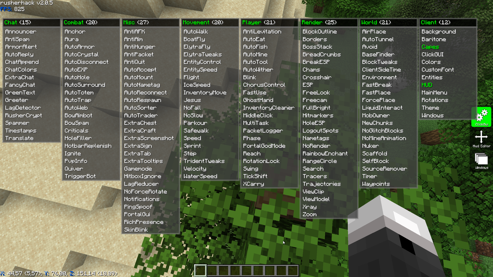

# RusherHack Plugin Collection

[![RusherHack v2.0.5](https://img.shields.io/badge/RusherHack-v2.0.5-purple?logo=data:image/png;base64,iVBORw0KGgoAAAANSUhEUgAAAOsAAADqCAYAAABDVrJwAAAAAXNSR0IArs4c6QAAAARnQU1BAACxjwv8YQUAAAAJcEhZcwAADsQAAA7EAZUrDhsAAAnnSURBVHhe7d0xjx1XGcbxnRUkQUE4Ekj+AqvUqaCMBClooKKAzhJtOiLRuIGIloiI0kTuEBIVoqDhK7ijc0NppUIoQWEt38yxZq3rdx5rX58z98w8c/+/6E1GzsyZOTPz+Pgc390d3n/v6nDR2Te+OUxbfT297t7Vi48+/mTa2r9Hjx5NW/v39798Nm31czn9F8DGEVbABGEFTOTDehjne7GwP+WxxnLTow9l2aW2KjGyAiYIK2CCsAImCCtgIh/WYZwZx6rVYwFAKZccCy/bwz3q0Qf1DmerEiMrYIKwAiYIK2CCsAIm1glrjwUARU32l7yWJdvqQd2PrVvyemNbre1lVb4njKyACcIKmCCsgAnCCphYPqyVk+fVLLnIoNpS1aKlvXhcj2cVz1mqxZLXG9tqbS9L3ZPEdTCyAiYIK2CCsAImCCtgYvGwDuNkOdZM+bVYexUXDl6xeJDW0l7tcS3iOXud100iD4ysgAnCCpggrICJ4YPvv7vnGePqfvWbP0xbR9Qd38Fc7unTp9NWP7/99YfT1kLUcxDP6ztvvzFt9cPICpggrIAJwgqYIKyACcK6pOO/+L8pJbtf1s1fpB/XVmz52pQNXy9hBUwQVsAEYQVMEFbABGFd0lqLE7ULVi3Xq45VVXttmCGsgAnCCpggrIAJwgqYIKxZe1wkiX16nX6pY1WdE7XAtiDCCpggrIAJwgqYIKyACcKadcKFg9XEPu2lX2s58QIbYQVMEFbABGEFTBBWwARhPWcnXhDZFNVXVT1ULuwRVsAEYQVMEFbABGEFTAzfe+ed2fT2cJjPeOXce8jNyA/hx58Ph9PP5GUfLsV5n4nZveiXai/K3qNMW8+J30rVvZN9TZxX7ZMl+7Dw9SrpexeoZ39Qz14YRL8Oz6aNhWR6z8gKmCCsgAnCCpggrIAJucDUIrN4kF6cUJP45IJNZoHldWT6oBYJ6s+Y70P1fup+iLZkx5ILc2lhEbJQizipPijZaxPtqTOo1uR+LfckYGQFTBBWwARhBUwQVsBE0wJT7YJNy+S8ZYFFLmJVfpoqex1qwUIudrTspyTuibxedUqxmJRdOMm+I7XPOvscstehtPRVHqnai8eKfRhZAROEFTBBWAEThBUwkV5gapmgx98S0os66pzJxYPaBYsi01fZg4ZzSgv3f9Ze9joU8Ymjiw5f+piReX5F+jlsBCMrYIKwAiYIK2Bi+O6dO7M/4Ms/yS/45/umeVyD6rldEfZrmRfJY9Vvm+qrTqb/viR5jngtS96P5xr2E0fqawla+pA9Z/ZZK6oHmfOqczKyAiYIK2CCsAImCCtgQn8oQs3Ps195oSbjcT812Re/bbR8f+HsooA8Q6Zf2b4Laq/swoa855WWXjhR9yTbhzX6mm5fHCvvnBr6Kr+/sLo2RlbABGEFTBBWwARhBUws/m1d5KQ97pec2LcsgCjqBwxlv1Kk9lp+/+mn09YtVPPJ9Q/ls08+nrb6+de/P5+2jogFFtlV8U7I92v67wuZ963I7qck39e07PUFjKyACcIKmCCsgAnCCphYPKxlUSBWlNmnKFPuWFnq2PKDjmaVvZZhuLWaxIttbE46cfvy/pZfD9Vy72btDeMziyX2m/V9LL3f+D9iCfK9EaX2G//P/LwJjKyACcIKmCCsgAnCCphoCqtaKFB1cflylSl7rHHmPasy8Y6lyHOqEsqvxlLXEkstHHRRTpMpJe4jO19v4eZke7Pn/Gz8xVBxn1LlSzxjqf2U7LOOt7eUOoeqWUcFRlbABGEFTBBWwARhBUzosMbJbqkyqY4lqMn4bHJf9gs1zrLnJajJuTpnVryO50eObcYq3yPquNR1dFFOk6kM2fl6qjl5n8rziSWUX53VuO9tzznuU0peh5A9NluqPVkhI+MvzkqHFcDmEFbABGEFTBBWwMSlmuzKmf04WY6ljlWT7Exl21LUftn2VKljZ5+UwYy6l0p8tUop5ehZiXPEUuQzFbLtqYtT51DtZWr816wYWQEThBUwQVgBE4QVMFG+aG02V1YT5fFfs1ITY3lsgmprdmFjZdtX7aljValjYynZ/c7d0eN8UVK5f7Gi8XnFUs9BlXr2ityv7BoqfQ5Rs30ERlbABGEFTBBWwARhBUwMH/zgXT2bPaH//PeraauvO99+c9rq5/pafNyp+x3v44uv/j9t9fP2m29MW319eX09bR058XNlZAVMEFbABGEFTBBWwARhLR+KibWksugQa8uy9yO7316t8FwJK2CCsAImCCtgYh9hbZk/rTD32LTs/VD7ZWsrWt6bFTCyAiYIK2CCsAImCCtgYh9h3fIixpYtvcCi2lO1FWbvDSMrYIKwAiYIK2CCsAIm1gnrlhcdOkh3P71jJbMFFkeD+KcWIytggrACJggrYIKwAibWCata2IgLKfXz8NNY8NpU96X0jtiE+I6MdRD/1GJkBUwQVsAEYQVMEFbAxPD+e1fdly3W+KE+xZ//9s9p6wyUBY4tOPFz/flPfjht9ZX+gVjqOVTeE0ZWwARhBUwQVsAEYQVM6LAefQLjRS2pTLBjtTj19QK1FnzXGVkBE4QVMEFYAROEFTChw7rgpLgLt+vdqz08hw33gZEVMEFYAROEFTBBWAEThHUNfOLqtFoWiTb8bAgrYIKwAiYIK2CCsAIm9hvWDS8UNC2AZNWeo/a4Lck++7X6mr2+gJEVMEFYAROEFTBBWAETfmHNTs7XWjzYiux9itRxqtay5HXEtlrby6p8NxlZAROEFTBBWAETq/xgqj/99R/TVl9XV1fTVj/37t2btjYgzskWfvIPHz6ctvp5/PjxtNXXL376o2nrFmoeXHnfGVkBE4QVMEFYAROEFTBBWM/JzV/A39SZOxwOs1pcvOcNpyCsgAnCCpggrIAJwgqY2E5Yj7/y4abg71uiTi35Lg3DMKsu4rUlT8vICpggrIAJwgqYIKyAie2EdcFPemBD/ifq1JZ+lyoXhF6p8voYWQEThBUwQVgBE4QVMEFYgdtULgi9lsQCFmEFTBBWwARhBUwQVsDEZZzXvmJui7dCrWWNB7bGOc9NYgGLkRUwQVgBE4QVMEFYARNtP0VOLTQkWvvdH3M/bUx90+WW75Pz4MGDaaufJ0+eTFv7d/fu3Wmrn/v3709bff3yZz+etvphZAVMEFbABGEFTBBWwERbWG8+bXFcC4rfgLllcanZzSd3bgrIiO9Nw7vDyAqYIKyACcIKmCCsgAnCmnXChbSz07LoUnvcWuJ70/DuEFbABGEFTBBWwARhBUwQVvTXsuhSe9wOEFbABGEFTBBWwARhBUz0Cavbp06ADWJkBUwQVsAEYQVM9AnrGf9FNlYQ10h2sk7CyAqYIKyACcIKmCCsgIWLi68BQPqYEKtSNCEAAAAASUVORK5CYII=)](https://rusherhack.org/changelog.html)

### ⚠️ WARNING: None of the plugins here have been verified or are confirmed to be safe. Use at your own risk!
### ❗ NOTICE: The plugins listed here are not affiliated with Rusher Development LLC.

## Introduction

This repository is a collection of third-party plugins developed for the RusherHack Utility Mod. These plugins extend the functionality of RusherHack by adding new features and tools that can enhance your gameplay experience. Please note that the plugins provided here are not officially verified or endorsed by Rusher Development LLC.

## Table of Contents

- [Installation](#installation)
- [Plugin Examples/Info](#plugin-examplesinfo)
- [Dev Tools](#dev-tools)
- [Plugins List](#plugins-list)
- [Reporting Issues](#reporting-issues)
- [Contribute](#contribute)

## Installation

*Plugins are currently only able to be loaded in developer mode.

*Eventually in rusherhack v2.1 there will be an in-game plugin manager and repository for verified plugins.

**⚠️ WARNING: DO NOT ENABLE PLUGINS IF YOU DO NOT KNOW WHAT YOU ARE DOING.**

Enabling plugins in rusherhack 2.0:
- Add the JVM flag `-Drusherhack.enablePlugins=true` to the game's JVM arguments.
- Create the directory `.minecraft/rusherhack/plugins/`

Installing plugins:
- Download the desired plugin(s) `.jar` files.
- Place them in the `.minecraft/rusherhack/plugins/` directory.

Plugins in the plugins folder will be loaded on startup. 
You can reload and load new plugins while in-game by using the `*reload` command

## Plugin Examples/Info

Here are some helpful resources and examples for developing RusherHack plugins:

- [Example Plugin](https://github.com/RusherDevelopment/example-plugin): A basic example plugin demonstrating the structure and capabilities of RusherHack plugins.
- [RusherGUI](https://github.com/xyzbtw/rusherGUI): An example plugin showcasing a custom theme with RusherHack.
- [RusherHack API Javadocs](https://javadocs.rusherhack.org): The official documentation for RusherHack's API, provides detailed information on available classes, methods, and usage.

## Dev Tools

These tools can assist in managing and developing RusherHack plugins:

- ### [RHP](https://github.com/kybe236/rhp)  
  
    
  
  **Creator**:  [kybe236](https://github.com/kybe236)

  A package manager that installs RusherHack plugins for you and sets the needed flags.

## Plugins List

  
Badge Info

  
  - **Latest Release**: Clicking on this badge will take you to the releases page for the plugin.
  - **Downloads**: Clicking on the downloads badge will directly download the latest version of the plugin.
  

<!-- START PLUGINS LIST -->

- ### [Example Plugin](https://github.com/RusherDevelopment/example-plugin)  

     

   **Creator**:  [RusherDevelopment](https://github.com/RusherDevelopment)

   A basic example plugin demonstrating the structure and capabilities of RusherHacks plugins.

---

- ### [2b2t.vc Rusherhack](https://github.com/rfresh2/2b2t.vc-rusherhack)  

     

   **Creator**:  [rfresh2](https://github.com/rfresh2)

   A RusherHacks plugin designed for 2b2t.vc server use.

   

     
Show Screenshots

     

       
       
     

   

---

- ### [RusherHack Custom HUDElement](https://github.com/Aspect-404/RusherHack-CustomHUDElement)  

     

   **Creator**:  [Aspect-404](https://github.com/Aspect-404)

   Make a customizable text HUD element for Minecraft utility mod RusherHack.

   

     
Show Screenshots

     

       
       
     

   

---

- ### [Auto Anvil Rename](https://github.com/IceTank/AutoAnvilRename)  

     

   **Creator**:  [IceTank](https://github.com/IceTank)

   Automates the renaming process in anvils.

   

     
Show Screenshots

     

       
       
     

   

---

- ### [Queue Manager](https://github.com/GabiRP/QueueManager)  

     

   **Creator**:  [GabiRP](https://github.com/GabiRP)

   Manages queue positions and notifies users of their status.

---

- ### [RusherHack Instance Info](https://github.com/John200410/rusherhack-instance-info)  

     

   **Creator**:  [John200410](https://github.com/John200410)

   Provides detailed information about the current instance.

   

     
Show Screenshots

     

       
       
       
     

   

---

- ### [OP Plugin](https://github.com/theoplegends/op-plugin)  

     

   **Creator**:  [theoplegends](https://github.com/theoplegends)

   Current features: Autopearl, JakeOrganCrash, HoleEscape, PaperCrash, TrapESP.

---

- ### [Stash Mover Plugin](https://github.com/xyzbtw/StashMoverPlugin)  

     

   **Creator**:  [xyzbtw](https://github.com/xyzbtw)

   A plugin to move stashes using pearls.

   

     
Show Screenshots/Videos

     

       
     

   

---

- ### [Unified Module List](https://github.com/czho/unified-modulelist)  

     

   **Creator**:  [czho](https://github.com/czho)

   Rusherhack HUD element that shows active modules from both meteorclient and rusherhack.

---

- ### [Container Tweaks](https://github.com/rfresh2/ContainerTweaks-rusherhack)  

     

   **Creator**:  [rfresh2](https://github.com/rfresh2)

   Simple tweaks for quickly moving items in containers.

   

     
Show Screenshots

     

       
     

   

---

- ### [RusherHack Spotify Integration](https://github.com/John200410/rusherhack-spotify)  

     

   **Creator**:  [John200410](https://github.com/John200410)

   Integrates Spotify music playback controls and status into the RusherHacks client.

   

     
Show Screenshots

     

       
       
     

   

---

- ### [Vanilla Elytra Flight](https://github.com/FBanna/Rusherhack-Vanilla-Efly)  

     

   **Creator**:  [FBanna](https://github.com/FBanna)

   Highly customizable rusher hack elytra flight plugin.

---

- ### [RusherGUI](https://github.com/xyzbtw/rusherGUI)  

     

   **Creator**:  [xyzbtw](https://github.com/xyzbtw)

   Rusherhack GUI example plugin.

---

- ### [Rusherhack BookBot](https://github.com/Aspect-404/Rusherhack-BookBot)  

     

   **Creator**:  [Aspect-404](https://github.com/Aspect-404)

   Rusherhack plugin for bookbot.

---

- ### [Shay's RusherTweaks](https://github.com/ShayBox/ShaysRusherTweaks)  

     

   **Creator**:  [ShayBox](https://github.com/ShayBox)

   A collection of small tweaks and improvements for the RusherHacks client.

---

- ### [Nuker](https://github.com/beanbag44/Nuker)  

     

   **Creator**:  [beanbag44](https://github.com/beanbag44)

   Epic nuker for nuking terrain.

   

     
Show Screenshots/Videos

     

       
     

   

---

- ### [Hold Rusher](https://github.com/cherosin/hold-rusher)  

     

   **Creator**:  [cherosin](https://github.com/cherosin)

   Adds a "Hold" flag for all modules, if active keybind will only be toggled while held.

---

- ### [No Walk Animation](https://github.com/Eonexe/NoWalkAnimation)  

     

   **Creator**:  [Eonexe](https://github.com/Eonexe)

   Removes the walking animation.

---

- ### [NBT Utils](https://github.com/kybe236/rusherhack-nbt-utils)  

     

   **Creator**:  [kybe236](https://github.com/kybe236)

   Rusher nbt paste and copy.

---

- ### [Rusherhack Executer](https://github.com/kybe236/rusherhack-executer)  

     

   **Creator**:  [kybe236](https://github.com/kybe236)

   Executes commands and resolves `<player>` to every player online.

---

- ### [F3 Spoof](https://github.com/Doogie13/f3-spoof)  

    
    

   **Creator**:  [Doogie13](https://github.com/Doogie13)

   Spoofs the F3 debug screen information.

---

- ### [Open Folder](https://github.com/kybe236/rusherhack-open-folder)  

     

   **Creator**:  [kybe236](https://github.com/kybe236)

   Opens the folder for the module with a button click.

   

     
Show Screenshots/Videos

     

       
     

   

---

- ### [Mace Kill](https://github.com/kybe236/rusherhack-mace-kill)  

     

   **Creator**:  [kybe236](https://github.com/kybe236)

   One shot pretty much all mobs with a mace.

   

     
Show Screenshots/Videos

     

       
     

   

---

- ### [Weather Changing Plugin](https://github.com/Lokfid/WeatherChangingPlugin)  

     

   **Creator**:  [Lokfid](https://github.com/Lokfid)

   Allows players to change the weather in-game.

---

- ### [Middleclick Wind Charge](https://github.com/kybe236/rusherhack-middleclick-wind-charge)  

     

   **Creator**:  [kybe236](https://github.com/kybe236)

   Allows you to throw windcharges with the middle mouse button and also jump at the same time so you can boost jump.

   

     
Show Screenshots/Videos

     

       
     

   

---

- ### [GarlicSight](https://github.com/GarlicRot/GarlicSight)  

     

   **Creator**:  [GarlicRot](https://github.com/GarlicRot)

   A RusherHacks Plugin - Crosshair Info - GarlicSight.

   

     
Show Screenshots

     

       
       
       
     

   

---

- ### [LightningPop](https://github.com/GarlicRot/LightningPop)  

     

   **Creator**:  [GarlicRot](https://github.com/GarlicRot)

   A RusherHacks Plugin - Spawns Lightning On Totem Pops And Player Deaths - LightningPop.

   

     
Show Screenshots

     

       
     

   

---

- ### [AutoBucket](https://github.com/GarlicRot/AutoBucket)  

     

   **Creator**:  [GarlicRot](https://github.com/GarlicRot)

   A RusherHacks Plugin - Auto Bucket Entities - AutoBucket.

   

     
Show Screenshots

     

       
     

   

---

- ### [rusherNodusTheme](https://github.com/bakjedev/rusherNodusTheme)  

     

   **Creator**:  [bakjedev](https://github.com/bakjedev)

   Nodus - Best theme evaAAAA. code is terrible. blame xyzbtw!

   

     
Show Screenshots

     

       
     

   

---

- ### [nhack-theme](https://github.com/h1tm4nqq/Nhack-theme)  

     

   **Creator**:  [h1tm4nqq](https://github.com/h1tm4nqq)

   A theme like Nhack 2015 for rh.

---

- ### [RusherHack-BoatExecute](https://github.com/PhilipPanda/RusherHack-BoatExecute)  

     

   **Creator**:  [PhilipPanda](https://github.com/PhilipPanda)

   A RusherHack module plugin for 1.20.4 that exploits boat movement packets to instantly kill all passengers.

   

     
Show Screenshots/Videos

     

       
     

   

---

- ### [NBT Viewer](https://github.com/Gentleman2292/NBT-viewer)  

     

   **Creator**:  [Gentleman2292](https://github.com/Gentleman2292)

   A plugin to view NBT data in Minecraft.

   

     
Show Screenshots

     

       
     

   

---

- ### [Remote Control](https://github.com/kybe236/rusherhack-remote-controle)  

     

   **Creator**:  [kybe236](https://github.com/kybe236)

   A plugin for remote controlling RusherHacks.

---

- ### [Speed Measure](https://github.com/Lokfid/RusherHackSpeedMeasure)  

     

   **Creator**:  [Lokfid](https://github.com/Lokfid)

   A plugin to measure speed in RusherHacks.

   **Original Creator**:  [IceTank](https://github.com/IceTank)

---

- ### [TNT Bomber](https://github.com/kybe236/rusher-tnt-bomber)  

     

   **Creator**:  [kybe236](https://github.com/kybe236)

   A plugin to automate TNT bombing in Minecraft.

---

- ### [No Render Entities](https://github.com/John200410/norender-entities)  

     

   **Creator**:  [John200410](https://github.com/John200410)

   A plugin to disable rendering of entities.

---

- ### [RusherHack Messenger](https://github.com/Gentleman2292/rusherhack-messenger)  

     

   **Creator**:  [Gentleman2292](https://github.com/Gentleman2292)

   A messaging plugin for RusherHacks.

   

     
Show Screenshots/Videos

     

       
     

   

---

- ### [RusherHack Instance Info (Fork)](https://github.com/GarlicRot/rusherhack-instance-info)  

     

   **Creator**:  [GarlicRot](https://github.com/GarlicRot)

   A forked version of the [original plugin](https://github.com/John200410/rusherhack-instance-info) with custom settings.

   

     
Show Screenshots

     

       
       
       
     

   

---

- ### [RusherHack NoteBot](https://github.com/Lokfid/RusherHackNoteBot)  

     

   **Creator**:  [Lokfid](https://github.com/Lokfid)

   A RusherHacks plugin for playing note blocks in Minecraft.

---

- ### [ShulkerViewer](https://github.com/xyzbtw/ShulkerViewer)  

     

   **Creator**:  [xyzbtw](https://github.com/xyzbtw)

   A RusherHacks plugin to view the contents of Shulker boxes in the inventory.

---

- ### [RusherWebPlugin](https://github.com/Lokfid/RusherWebPlugin)  

     

   **Creator**:  [Lokfid](https://github.com/Lokfid)

   Web Browser for rh.

---

- ### [UpdatedNCPEfly](https://github.com/xyzbtw/UpdatedNCPEfly)  

     

   **Creator**:  [xyzbtw](https://github.com/xyzbtw)

   A plugin for an updated version of NCPEfly.

---

- ### [dc-chat-logger](https://github.com/kybe236/dc-chat-logger)  

     

   **Creator**:  [kybe236](https://github.com/kybe236)

   A plugin for logging chat messages to discord.

---

- ### [rusherhack-nightvision-plugin](https://github.com/John200410/rusherhack-nightvision-plugin)  

     

   **Creator**:  [John200410](https://github.com/John200410)

   A replacement for FullBright when using shaders.

---

- ### [AutoNetherite](https://github.com/xyzbtw/AutoNetherite)  

     

   **Creator**:  [xyzbtw](https://github.com/xyzbtw)

   A plugin that automates the process of upgrading gear to Netherite in Minecraft.

---

- ### [OldSignsPlugin](https://github.com/xyzbtw/OldSignsPlugin)  

     

   **Creator**:  [xyzbtw](https://github.com/xyzbtw)

   A plugin that brings back old sign functionalities in Minecraft.

---

- ### [StashHunter-rusherhack](https://github.com/CherkaSSH/StashHunter-rusherhack)  

     

   **Creator**:  [CherkaSSH](https://github.com/CherkaSSH)

   A plugin to help locate stashes in Minecraft using RusherHack.

---

- ### [rusher-elytra-eta](https://github.com/kybe236/rusher-elytra-eta)  
     

   **Creator**:  [kybe236](https://github.com/kybe236)

   A rusherhack plugin that allows you to see the ETA of all Elytras in the player's inventory.

   

    
Show Screenshots

     

      
    

   

---

- ### [rusher-silent-close](https://github.com/kybe236/rusher-silent-close)  

     

   **Creator**:  [kybe236](https://github.com/kybe236)

   Keeps Container GUI open

---

- ### [AFKBoostEfly](https://github.com/miles352/AFKBoostEfly)  

     

   **Creator**:  [miles352](https://github.com/miles352)

   A plugin that automates boosting Elytra flight while AFK.

---

- ### [rusher-gtranslate](https://github.com/kybe236/rusher-gtranslate)  

     

   **Creator**:  [kybe236](https://github.com/kybe236)

   A plugin that integrates Google Translate into RusherHack for translating chat messages.

---

- ### [rusher-matrix-nofall](https://github.com/kybe236/rusher-matrix-nofall)  
      
   **Creator**:  [kybe236](https://github.com/kybe236)
  
   No Fall by setting isFalling flag in movement packets to false (tested on 6b6t).

---

- ### [rusher-autoportal](https://github.com/kybe236/rusher-autoportal)  
      
   **Creator**:  [kybe236](https://github.com/kybe236)
  
   Automaticly breaks block to places obsidian and activate nether portal.

---

- ### [rusher-air-place](https://github.com/kybe236/rusher-air-place)  

     

   **Creator**:  [kybe236](https://github.com/kybe236)

   A plugin that allows placing blocks in the air in Minecraft.

<!-- END PLUGINS LIST -->

## Reporting Issues

If you encounter issues with any of the plugins listed here, please contact the plugin's creator or open an issue in their respective repository. 

For issues related to the collection repository itself, such as incorrect plugin information, broken links, or formatting errors, please use the [Plugin Information Issue](https://github.com/RusherDevelopment/rusherhack-plugins/issues/new?assignees=&labels=&template=plugin-information-issue.md&title=%5BISSUE%5D) tracker.

## Contribute

If you have a RusherHack plugin you'd like to add to this list, please submit a pull request with the plugin details! For more detailed instructions on how to contribute, please see the [Contributing Guide](./CONTRIBUTING.md).
